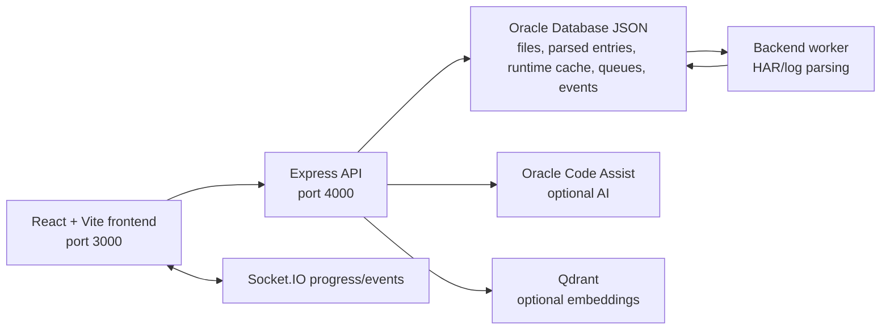

# HAR File Analyzer

HAR File Analyzer is an internal diagnostic application for reviewing browser HAR files and console logs. It helps engineers identify failed requests, slow requests, redirects, CORS/status-zero failures, suspicious domains, console-log signals, and AI-assisted investigation summaries without manually reading raw HAR JSON.

This repository contains the frontend, backend API, background worker, local dependency containers, OpenAPI contract, and deployment notes needed to run or maintain the tool.

## Deployment Options

### Use the hosted internal environment

For users who only need to analyze files and do not want to run the stack locally, use the current internal deployment over VPN:

- Frontend: `http://10.65.39.163:3000/`
- Frontend hostname: `http://celvpvm05798.us.oracle.com:3000/`
- Backend API: `http://10.65.39.163:4000`
- OpenAPI documentation: `http://10.65.39.163:4000/api-docs`
- OpenAPI JSON: `http://10.65.39.163:4000/openapi.json`

The hosted deployment is intended for internal Oracle network/VPN access. Do not expose it publicly without an approved authentication, TLS, and network-control layer.

### Run locally for development

Run the application locally when developing, testing backend changes, debugging upload/worker behavior, or validating API changes before deployment.

The recommended local dependency path is:

- Oracle Database with JSON support: stores HAR metadata, HAR entries, console-log files, console-log entries, runtime cache keys, queue jobs, upload progress, and Socket.IO event envelopes.
- Qdrant: optional; used by embedding-related AI paths when available.

## Architecture



Primary runtime components:

| Component | Location | Responsibility |
| --- | --- | --- |
| Frontend | `src/` | Analyzer UI, Request Flow, Console Log Analyzer, AI Insights, sanitization UI, comparison workflow |
| Backend API | `backend/src/server.ts` | REST API, OpenAPI docs, upload orchestration, status, AI routes, sanitization routes |
| Worker | `backend/src/worker.ts` | Background parsing and persistence for uploaded HAR/log files |
| Oracle Database JSON | external or local Oracle database | Persistent analysis data plus runtime cache, queue, and event documents |
| Qdrant | external/container, optional | Embedding storage for optional AI retrieval paths |

## Repository Structure

```text
HAR-File-Analyser/
|-- src/                         # React frontend
|   |-- components/              # Analyzer views and shared UI components
|   |-- services/                # API, AI, WebSocket, and upload clients
|   |-- utils/                   # HAR/log parsing and frontend helpers
|   `-- styles/                  # Global styling
|-- backend/
|   |-- src/
|   |   |-- routes/              # Express REST routes
|   |   |-- services/            # Parsing, automation, retention, and AI services
|   |   |-- config/              # Database, CORS, proxy, queue, and upload configuration
|   |   |-- workers/             # Storage and worker helpers
|   |   `-- utils/               # Backend utilities
|   |-- docker-compose.yml       # Optional local Qdrant dependency
|   `-- package.json             # Backend scripts
|-- docs/                        # Integration, Confluence, and planning docs
|-- scripts/                     # Local developer utilities
|-- VM_RUNBOOK.md                # Current VM deployment and troubleshooting runbook
|-- .env.example                 # Frontend environment template
`-- backend/.env.example         # Backend environment template
```

## Prerequisites

- Node.js 22.x recommended.
- npm 11.x recommended.
- Docker Desktop or Rancher Desktop for optional local Qdrant container.
- Oracle Database access with JSON support for backend persistence and runtime coordination.
- Git.
- Access to Oracle VPN/internal network for the hosted environment and OCA-backed AI features.

## Runtime Dependencies and Third-party Code

The application code expects the following external services or infrastructure to be available, depending on the environment:

| Dependency | Required | Purpose |
| --- | --- | --- |
| Oracle Database with JSON support | Yes | Stores uploaded file metadata, parsed HAR entries, console-log entries, analysis state, runtime cache keys, queue jobs, upload progress, and event delivery state |
| Qdrant | Optional | Vector/embedding storage for optional retrieval-oriented AI paths |
| Oracle Code Assist (OCA) | Optional | Generates AI-assisted insight summaries when `OCA_BASE_URL` and `OCA_TOKEN` are configured |
| Oracle corporate proxy | Environment-dependent | Required in some Oracle networks for outbound backend calls to OCA |
| Docker/Rancher Desktop container images | Local development only | Pulls optional local Qdrant container for embedding experiments |
| Internal VM/VCAP hosting | Hosted deployment only | Runs the current internal frontend, backend API, and worker processes |

Third-party code attribution:

| Source | Where used | Notes |
| --- | --- | --- |
| Cloudflare HAR Sanitizer | `src/utils/har_sanitize.ts`, `backend/src/utils/har_sanitize.ts`, and `src/components/HarSanitizer.tsx` | The HAR sanitization logic and UI are based on Cloudflare's public HAR Sanitizer project. This is source-code attribution only; the app does not call Cloudflare at runtime for sanitization. Upstream project: `https://github.com/cloudflare/har-sanitizer`. License shown upstream: Apache-2.0. Keep this item visible for Oracle OSS/security review before broad rollout. |

On Windows, if `npm` fails with `node.exe is not recognized`, make sure Node is on the current shell path before running project commands:

```powershell
$env:Path = "C:\nvm4w\nodejs;$env:Path"
node -v
npm -v
```

## Environment Configuration

Environment files are intentionally not committed. Use the example files as templates:

```powershell
Copy-Item .env.example .env
Copy-Item backend/.env.example backend/.env
```

Frontend local defaults:

```env
VITE_API_URL=http://localhost:4000
VITE_BACKEND_URL=http://localhost:4000
VITE_WS_URL=http://localhost:4000
```

Backend local defaults:

```env
PORT=4000
PUBLIC_API_URL=http://localhost:4000
OPENAPI_SERVER_URL=http://localhost:4000

PERSISTENCE_BACKEND=oracle-json
ORACLE_DB_USER=
ORACLE_DB_PASSWORD=
ORACLE_DB_CONNECT_STRING=
ORACLE_JSON_TABLE=HAR_ANALYZER_DOCS
ORACLE_DB_POOL_MIN=1
ORACLE_DB_POOL_MAX=10

QDRANT_URL=http://localhost:6333
ORACLE_QUEUE_POLL_INTERVAL_MS=500
ORACLE_EVENT_POLL_INTERVAL_MS=250

UPLOAD_DIR=./uploads
PROCESSED_DIR=./processed
CORS_ORIGIN=http://localhost:3000,http://localhost:5173

OCA_BASE_URL=
OCA_TOKEN=
OCA_MODEL=oca/gpt-5.4
HTTPS_PROXY=
HTTP_PROXY=

RETENTION_CLEANUP_ENABLED=false
RETENTION_MAX_AGE_HOURS=168
RETENTION_CLEANUP_INTERVAL_MINUTES=60
RETENTION_CLEANUP_DRY_RUN=true
```

Do not commit real `.env` files, OCA tokens, proxy credentials, customer HAR files, console logs, generated uploads, or processed artifacts.

## Local Setup

Install frontend dependencies from the repository root:

```powershell
npm install
```

Install backend dependencies:

```powershell
cd backend
npm install
cd ..
```

Start optional local Qdrant container if you want to test embedding-related AI retrieval paths:

```powershell
docker compose -f backend/docker-compose.yml up -d qdrant
```

Configure `backend/.env` with an Oracle Database user, password, and connect string before starting the backend. This branch is Oracle-only: queueing, transient metadata, upload progress, and Socket.IO event delivery are all backed by Oracle Database documents.

## Running the App

Recommended one-command local startup from the repository root:

```powershell
npm run dev:all
```

This starts the Vite frontend, Express backend API, and backend worker in one terminal. Use this for normal local development after Oracle Database credentials are configured. Qdrant is optional.

Expected local URLs:

- Frontend: `http://localhost:3000/`
- Backend health: `http://localhost:4000/health`
- Backend readiness: `http://localhost:4000/ready`
- Operations status API: `http://localhost:4000/api/ops/status`
- OpenAPI docs: `http://localhost:4000/api-docs`

Stop the development processes with `Ctrl+C`. Stop local containers when no longer needed:

```powershell
docker compose -f backend/docker-compose.yml down
```

To remove local Qdrant data volumes as well:

```powershell
docker compose -f backend/docker-compose.yml down -v
```

Use individual processes only when debugging startup order, worker behavior, or API failures.

Frontend:

```powershell
npm run dev
```

Backend API:

```powershell
cd backend
npm run dev
```

Worker:

```powershell
cd backend
npm run dev:worker
```

The worker is required for uploaded files to finish processing. If the frontend upload succeeds but the file stays in processing, confirm the worker is running and the backend and worker can both reach the same Oracle Database.

## Build and Test

Frontend build:

```powershell
npm run build
```

Frontend tests:

```powershell
npm run test
```

Backend build:

```powershell
cd backend
npm run build
```

Backend tests:

```powershell
cd backend
npm run test
```

OpenAPI endpoint smoke tests:

```powershell
npm run test:openapi:endpoints
npm run test:openapi:stress
```

Recommended pre-handoff validation:

```powershell
npm run build
cd backend
npm run test
npm run build
```

## REST API and Automation Integration

The backend has REST APIs enabled and publishes an OpenAPI 3.0 contract:

- `GET /openapi.json`
- `GET /api-docs`

OCI automation and other integration clients should use the stable `/api/v1` HAR endpoints after upload and processing:

| Method | Endpoint | Purpose |
| --- | --- | --- |
| `GET` | `/api/v1/har/{fileId}/summary` | Automation-ready HAR summary |
| `GET` | `/api/v1/har/{fileId}/errors` | Failed-request list for triage |
| `GET` | `/api/v1/har/{fileId}/insights/context` | Backend-built bounded AI context |
| `POST` | `/api/v1/har/{fileId}/insights` | AI-assisted insight generation with deterministic fallback |

General API groups:

- `/api/upload/*` for chunked file upload and upload progress.
- `/api/har/*` for HAR status, entries, search, details, stats, and full HAR streaming.
- `/api/console-log/*` for console-log status, paged entries, search, details, and stats.
- `/api/sanitize/*` for sensitive-data scan and sanitized HAR creation.
- `/api/ai/*` for AI status, insights, and streaming chat.
- `/api/ops/status` for color-coded runtime, queue, storage, and optional dependency health.
- `/ready` for readiness checks that return `503` when core runtime checks fail.

See [docs/openapi-automation.md](docs/openapi-automation.md) and [docs/oci-openapi-integration-brief.md](docs/oci-openapi-integration-brief.md) for integration-oriented guidance.

## Docker and Container Notes

`backend/docker-compose.yml` is the recommended optional local dependency compose file. It starts Qdrant only. Oracle Database is expected to be provided by an approved Oracle environment or local Oracle Database setup.

```powershell
docker compose -f backend/docker-compose.yml up -d qdrant
```

The root `docker-compose.yml` and `Dockerfile` are not the current full-stack production deployment path. Treat them as legacy/experimental frontend-plus-Ollama assets unless the development team decides to build a full application container strategy.

For a production container deployment, create separate runtime definitions for:

- Frontend static hosting or Vite preview replacement.
- Backend API process.
- Backend worker process.
- Oracle Database with JSON support.
- Optional Qdrant or replacement retrieval service.

## Current VM/VCAP Deployment

The current internal deployment is documented in [VM_RUNBOOK.md](VM_RUNBOOK.md). At a high level:

1. Build frontend assets locally with `npm run build`.
2. Copy `dist/` to the VM frontend directory.
3. Pull latest backend code on the VM.
4. Build backend with `npm run build`.
5. Restart PM2 processes for backend, frontend, and worker as required.
6. Validate the frontend URL, backend health endpoint, and one upload flow.

Current process names commonly used on the VM:

- `har-frontend`
- `har-backend`
- `har-worker`

Use the runbook for exact PM2 restart and worker recreation steps.

## Data Handling and Security Notes

HAR files and console logs can contain sensitive data such as cookies, tokens, headers, URLs, request bodies, user identifiers, and environment details.

Required handling expectations:

- Keep `.env`, `backend/.env`, uploads, processed files, and generated artifacts out of Git.
- Use the built-in sanitization flow before sharing HAR files outside the immediate troubleshooting context.
- Treat hosted deployment access as internal-only unless authentication, TLS, rate limiting, and network controls are formally added.
- Use retention cleanup for long-running shared environments so uploaded files do not accumulate indefinitely.
- Run dependency vulnerability checks through Oracle ArtifactHub or the approved internal npm registry, and complete Oracle OSS/security review before broader production rollout.

Current API security posture:

- CORS is restricted to local origins plus the known internal frontend origins, with additional origins configurable through `CORS_ORIGIN`.
- Upload file IDs and file types are validated.
- Upload chunks are bounded by size and chunk-count validation.
- Lightweight observability is available through structured JSON logs, `/ready`, and `/api/ops/status`.
- The backend does not currently implement user authentication or authorization. Place it behind approved internal access controls before exposing it beyond trusted environments.

## AI Behavior

AI features are assistive, not the source of truth. The analyzer builds structured context from deterministic HAR/log evidence, sends that bounded context to OCA when configured, and displays AI output with deterministic fallback behavior when AI is unavailable or returns unusable output.

Operational expectations:

- `OCA_BASE_URL` and `OCA_TOKEN` must be configured in `backend/.env` or the deployment environment.
- AI output can vary between runs because it is generated by a model.
- Deterministic analyzer evidence, raw request details, parser metadata, and issue tags should be used to validate any AI explanation.
- The application should not claim an AI-confirmed root cause when only analyzer evidence is available.

## Troubleshooting

### Upload succeeds but analysis never becomes ready

Check:

- The backend worker is running.
- The file status events are reaching the frontend.
- Backend and worker both use the same Oracle Database connection configuration.

### Frontend loads but backend calls fail

Check:

- `VITE_API_URL`, `VITE_BACKEND_URL`, and `VITE_WS_URL`.
- Backend `PORT`.
- Backend CORS allowed origins.
- VPN/network access to the backend host.

### AI Insights or AI Chat is unavailable

Check:

- `OCA_BASE_URL`.
- `OCA_TOKEN`.
- `OCA_MODEL`.
- Proxy variables if running from an Oracle network that requires outbound proxy configuration.
- Backend logs from `/api/ai/status` requests.

### Node or npm is not found on Windows

Add Node to the current PowerShell path:

```powershell
$env:Path = "C:\nvm4w\nodejs;$env:Path"
node -v
npm -v
```

### Docker compose warns that `version` is obsolete

The warning is non-blocking with current Docker Compose. The compose file still starts the local dependency containers.

## Handoff Readiness

The codebase is organized in a standard frontend/backend/worker structure and is suitable for handoff to a development team. This branch uses Oracle Database for persistence, runtime cache, queueing, and event delivery. For production rollout, authentication, retention, observability, backup/restore, and Oracle Database operational sizing should be treated as production-readiness workstreams.

Detailed review notes are captured in [docs/handoff-readiness-review.md](docs/handoff-readiness-review.md).
