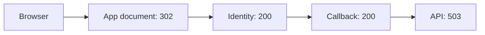

# Visual Support Report

Use this format after the deterministic analyzer completes. Omit a section if
the evidence does not support it. Do not add decorative prose or a raw event
dump.

## `HAR Analysis — <sanitized file name>`

Begin with one sentence naming the strongest observed outcome and the best next
action. Then render this compact status strip:

| Overall | Requests | Failures | P95 | Primary next action |
| --- | ---: | ---: | ---: | --- |
| `🔴 Critical` / `🟠 Attention` / `🟡 Review` / `🟢 Healthy` / `⚪ Inconclusive` | total | failed or status-0 count | duration | **action** |

Use `🔴` only for evidence-supported broad or blocking failure, `🟠` for a
confirmed user-visible issue, `🟡` for degraded/uncertain behavior, `🟢` for a
healthy capture, and `⚪` for insufficient evidence. Markdown does not support
reliable custom colors; these markers are the portable color treatment.

## Priority Findings

Use one table, sorted by severity. Limit it to eight rows. Include only a
finding that changes the investigation or action.

| Priority | What happened | Evidence | Impact and next check |
| --- | --- | --- | --- |
| `🔴 High — Observed` | **GET /orders** returned **503** twice | Requests 14, 16; `api.example.test`; 1.8 s, 1.6 s | Request failed repeatedly. **Check the upstream/service logs for this time window.** |

Use `Observed`, `Correlated`, or `Hypothesis` in the priority label. Preserve
the analyzer's confidence. Do not turn a status-0 candidate, an OPTIONS
request, a redirect, or a repeated successful request into a confirmed root
cause.

## Request Flow

Use the flow only to describe supplied evidence. When there are three or more
meaningful states, prefer a compact Mermaid diagram with sanitized labels:

For one or two states, use a single line instead:

`Browser → GET /health → 200 in 42 ms`

Show a failed terminal state, relevant redirect/auth handoff, and only the
dependencies needed to explain the outcome. Do not draw a flow from heuristic
phases alone when the URLs/timestamps do not support the connection.

## Performance and Domain Focus

Show this table only if there is a slow request, notable timing concentration,
or more than one domain:

| Focus | Evidence | Why it matters |
| --- | --- | --- |
| Slowest request | **GET /report** — 4.2 s; TTFB 3.8 s | Server wait dominates this request. |
| Highest-latency domain | `api.example.test` — 18 requests, 2 failures, P95 3.9 s | Prioritize it after terminal failures. |
| Delivery signal | 420 KB JavaScript without recorded compression | Optimization observation; validate response headers. |

Keep performance signals distinct from functional failures. Prefer the
analyzer's `topSlowRequests`, `timingPhaseTotalsMs`, and `domainAnalysis`.

## Recommended Actions and Limits

Use a concise action table, then one limits sentence:

| Order | Action | Reason |
| ---: | --- | --- |
| 1 | **Inspect the service/proxy logs at the failing request timestamp.** | Confirms the observed 5xx source. |
| 2 | Capture the matching browser console output. | Distinguishes client/network/CORS evidence from a server response. |

State missing evidence, parser fallbacks, and hypotheses in one sentence. For
example: `Limits: this capture has no console output; status 0 is a network
candidate, not CORS proof.`
