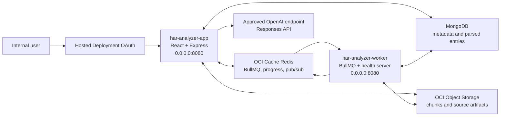
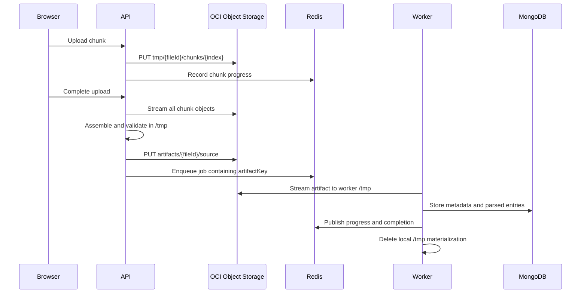

# OCI GenAI Hosted Deployment

## Purpose

This document defines the deployment contract for running HAR Analyzer in the OCI GenAI Hosted Deployment environment. The application retains MongoDB and Redis, uses OCI Object Storage for uploaded artifacts, and uses an approved OpenAI API key for optional AI-assisted analysis.

## Deployment Status

| Area | Repository status | External input still required |
| --- | --- | --- |
| Web/API runtime | Ready: combined frontend and API image listens on `0.0.0.0:8080` | Hosted Application, OAuth, DNS, and OCIR configuration |
| Worker runtime | Ready: worker image exposes health endpoints on `0.0.0.0:8080` | Separate Hosted Application or worker deployment |
| MongoDB | Supported and required | Approved reachable MongoDB connection string |
| Redis | Supports `REDIS_URL`, TLS, username, and password | OCI Cache Redis connection URI |
| File storage | OCI Object Storage adapter implemented | Namespace, bucket, resource-principal IAM policy, and lifecycle policy |
| AI | Optional: OpenAI Responses API implemented; deterministic fallback retained | None for initial deployment; GCGA-approved key, model, and egress can be added later |
| Image build | Reproducible Dockerfiles and Rancher Desktop build script included; application builds pass | Approved Oracle Artifactory, OCIR, or Oracle Container Registry Node base image and OCIR destination |

## Relationship to the OCI Container Instance POC

The June 2026 OCI Container Instance deployment remains the proof that the web, API, worker, MongoDB, and Redis application flow works in OCI. It is not the final Hosted Deployment topology.

| Validated Container Instance POC | GenAI Hosted Deployment replacement |
| --- | --- |
| `har-web` nginx container on port 80 | React assets served by the `har-analyzer-app` Express container on port 8080 |
| `har-api` container on port 4000 | `har-analyzer-app` Hosted Application on `0.0.0.0:8080` |
| `har-worker` shared the instance network and workspace | Separate `har-analyzer-worker` Hosted Application on `0.0.0.0:8080` |
| MongoDB sidecar on `localhost:27017` | Approved MongoDB service reachable from both Hosted Applications |
| Redis sidecar on `localhost:6379` | OCI Cache Redis URI reachable from both Hosted Applications |
| Shared `/workspace` upload and processed directories | OCI Object Storage for durable/cross-container artifacts; `/tmp` for disposable scratch only |
| Public IP and nginx reverse proxy | Hosted Application endpoint protected by the selected OAuth or IAM authentication path |

Do not copy the old five-container configuration into Hosted Deployment. In particular, do not deploy MongoDB or Redis sidecars, configure `localhost` database endpoints, mount a shared volume, or reuse ports 80, 3000, or 4000.

## Repository Validation

Validated on 2026-07-15 from branch `codex/genai-hosted-readiness`:

- Backend: 23 test files and 115 tests passed.
- Frontend: 36 test files and 285 tests passed.
- Frontend ESLint passed without warnings or errors.
- Backend TypeScript build passed.
- Frontend TypeScript and Vite production build passed.
- Root and backend production dependency audits both reported 0 vulnerabilities.
- Legacy OCA, browser-side AI, local-model, and unused vector retrieval runtime paths were removed.
- Git whitespace validation passed.

The local Hosted Deployment image rehearsal reached Oracle Linux base-image resolution and then stopped because the corporate VPN refused HTTPS connections to both `container-registry.oracle.com` and `container-registry-bom.oracle.com`. No application image was pushed. Use the OCI DevOps managed-build fallback below or provide an approved internal mirror before creating a Hosted Deployment artifact.

Public Docker Hub images are prohibited. The Dockerfiles have no public-registry default, and the build script rejects Docker Hub references. The repository includes `deploy/hosted/Dockerfile.node-base` to build Node.js 22 on the Oracle Linux 9 slim image from Oracle Container Registry. Publish that base to the project OCIR repository, use its immutable tag through `-NodeImage`, then complete the validation steps in this document before pushing an application image to OCIR.

## Target Architecture



The frontend is served by the Express API image. This gives users one Hosted Application endpoint and keeps browser API, SSE, and Socket.IO traffic same-origin. The worker is deployed separately because it consumes BullMQ jobs continuously and must scale independently from HTTP traffic.

## Runtime Images

### Application image

- Dockerfile: `deploy/hosted/Dockerfile.app`
- Default command: `node dist/server.js`
- Process: React static assets, Express REST API, OpenAPI, SSE, and Socket.IO
- Listening address: `0.0.0.0:8080`
- Liveness: `GET /health`
- Readiness: `GET /ready`
- Runs as the non-root `node` user

### Worker image

- Dockerfile: `deploy/hosted/Dockerfile.worker`
- Default command: `node dist/worker.js`
- Process: BullMQ HAR and console-log workers
- Listening address: `0.0.0.0:8080` for health only
- Liveness: `GET /health`
- Readiness: `GET /ready`
- Runs as the non-root `node` user

Do not override either image command in Hosted Deployment. Do not configure a second application process inside either image.

## Artifact Flow

Hosted Deployment does not provide a writable shared filesystem. All durable and cross-container file exchange therefore uses Object Storage.



Only disposable scratch files are written locally. The images set `HOME`, `TMPDIR`, upload scratch, assembly scratch, sanitizer scratch, and worker scratch under `/tmp`.

## Required Configuration

### Shared by application and worker

| Variable | Value or source | Required |
| --- | --- | --- |
| `NODE_ENV` | `production` | Yes |
| `HOSTED_DEPLOYMENT` | `true` | Yes |
| `HOST` | `0.0.0.0` | Recommended; also the code default |
| `MONGODB_URL` | Secret containing the approved MongoDB URI | Yes |
| `REDIS_URL` | Secret containing the OCI Cache `redis://` or `rediss://` URI | Yes |
| `ARTIFACT_STORE` | `oci-object-storage` | Yes |
| `OCI_OBJECT_STORAGE_NAMESPACE` | OCI Object Storage namespace | Yes |
| `OCI_OBJECT_STORAGE_BUCKET` | Dedicated bucket name | Yes |
| `OCI_OBJECT_STORAGE_PREFIX` | `har-analyzer` | Recommended |
| `OCI_AUTH_MODE` | `resource-principal` | Yes in Hosted Deployment |

Do not set `REDIS_HOST`, `REDIS_PORT`, `REDIS_USERNAME`, `REDIS_PASSWORD`, or `REDIS_TLS` when a complete `REDIS_URL` is supplied.

### Application only

| Variable | Value or source | Required |
| --- | --- | --- |
| `OPENAI_API_KEY` | GCGA-managed secret | Required only for AI |
| `OPENAI_MODEL` | Exact model approved for the governed key | Required only for AI |
| `OPENAI_BASE_URL` | Omit for `https://api.openai.com/v1`, or use the approved HTTPS gateway | Optional |
| `CORS_ORIGIN` | Final Hosted Application origin if cross-origin access is needed | Environment-specific |
| `JSON_BODY_LIMIT` | `10mb`; HAR/log uploads use bounded multipart chunks instead | Recommended |
| `PUBLIC_API_URL` | Final public Hosted Application URL | Recommended |
| `OPENAPI_SERVER_URL` | Final public Hosted Application URL | Recommended |
| `RETENTION_CLEANUP_ENABLED` | `true` after retention policy approval | Production decision |
| `RETENTION_CLEANUP_DRY_RUN` | `true` for initial validation, then `false` | Production decision |

The OpenAI key is used only by the backend. It must not be injected into frontend build arguments or exposed through any `VITE_*` variable. API requests use the Responses API with `store: false`; deterministic analyzer evidence remains available when AI is not configured or fails.

### Initial deployment without OpenAI

The application can be deployed before a governed OpenAI key is available:

- Do not set `OPENAI_API_KEY`, `OPENAI_MODEL`, or `OPENAI_BASE_URL` to placeholder values; omit them.
- `GET /api/ai/status` reports `configured: false` with HTTP 200.
- The AI chat control is not rendered.
- Deterministic Insights and all HAR/log analyzer features remain available.
- OpenAI is an optional operations check and does not affect `/ready`.
- The same images can later enable OpenAI through backend secret injection without a frontend rebuild.

### Worker only

| Variable | Value or source | Required |
| --- | --- | --- |
| `WORKER_CONCURRENCY` | Start with `2`, then tune after load testing | Recommended |

Hosted Deployment supplies or reserves the runtime port. The application honors `PORT` when the platform injects it and otherwise uses `8080` when `HOSTED_DEPLOYMENT=true`. Do not hard-code ports `80`, `3000`, or `4000` in the Hosted Application configuration.

Do not declare `PORT`, `K_SERVICE`, `K_CONFIGURATION`, `K_REVISION`, `OCI_RESOURCE_PRINCIPAL_VERSION`, `OCI_RESOURCE_PRINCIPAL_PRIVATE_PEM`, `OCI_RESOURCE_PRINCIPAL_RPST`, or any `KUBERNETES_*` variable in the image or Hosted Application configuration. Hosted Deployment owns these names.

## OCI IAM and Storage

Create a dedicated private Object Storage bucket in the `har-analyzer` compartment. Associate both Hosted Application resource principals with a dynamic group or the platform-equivalent identity mapping.

The least-privilege policy must allow both runtimes to inspect the bucket and manage objects only in the selected bucket. The tenancy IAM team should translate the following intent into the approved local policy form:

```text
Allow dynamic-group <har-analyzer-runtime-group> to read buckets in compartment har-analyzer
Allow dynamic-group <har-analyzer-runtime-group> to manage objects in compartment har-analyzer where target.bucket.name='<har-analyzer-bucket>'
```

Configure an Object Storage lifecycle rule for stale objects under `har-analyzer/tmp/`. Application retention cleanup removes normal artifacts and stale chunks, while the bucket lifecycle rule provides a recovery control for interrupted uploads.

## Build with Rancher Desktop

Run from the repository root:

```powershell
$env:Path = "C:\nvm4w\nodejs;$env:Path"

npm ci
npm --prefix backend ci
npm run test
npm --prefix backend run test
npm run build
npm --prefix backend run build

powershell -ExecutionPolicy Bypass -File scripts/build-hosted-node-base.ps1 `
  -NodeBaseImage bom.ocir.io/<namespace>/har-analyzer/node-base:ol9-node22-<release>

docker push bom.ocir.io/<namespace>/har-analyzer/node-base:ol9-node22-<release>

powershell -ExecutionPolicy Bypass -File scripts/build-hosted-images.ps1 `
  -NodeImage bom.ocir.io/<namespace>/har-analyzer/node-base:ol9-node22-<release> `
  -AppImage bom.ocir.io/<namespace>/har-analyzer/har-app:<tag> `
  -WorkerImage bom.ocir.io/<namespace>/har-analyzer/har-worker:<tag>
```

If the global Oracle Container Registry endpoint is blocked by the corporate network, use an approved Oracle regional mirror for the base build, for example:

```powershell
powershell -ExecutionPolicy Bypass -File scripts/build-hosted-node-base.ps1 `
  -OracleLinuxImage container-registry-bom.oracle.com/os/oraclelinux:9-slim `
  -NodeBaseImage bom.ocir.io/<namespace>/har-analyzer/node-base:ol9-node22-<release>
```

If both Oracle endpoints are blocked, mirror `container-registry.oracle.com/os/oraclelinux:9-slim` into the approved internal Artifactory or OCIR from an OCI DevOps build runner and pass that mirror URI through `-OracleLinuxImage`.

### OCI DevOps managed-build fallback

Use `deploy/hosted/build_spec.yaml` when the corporate VPN blocks Oracle Container Registry or package downloads from Rancher Desktop. Configure an OCI DevOps **Managed Build** stage with this file as its build-spec path. Use the Oracle Linux 8 runner so the included Podman commands are available.

The managed build produces three named Docker image artifacts:

```text
har-analyzer-node-base-image
har-analyzer-app-image
har-analyzer-worker-image
```

Add one **Deliver Artifacts** stage per artifact and map them to the corresponding private OCIR repository with the same immutable release version. The build stage performs the full frontend/backend test and build suite before constructing the images. If the runner cannot reach the global Oracle registry, set the build-spec `ORACLE_LINUX_IMAGE` variable to an approved internal Oracle Linux 9 slim mirror.

The scripts build `linux/amd64` images. The application build fails if an image is not `amd64`, runs as root, does not expose 8080, or declares a Hosted Deployment reserved environment variable.

Push after authenticating Rancher Desktop to OCIR:

```powershell
docker push bom.ocir.io/<namespace>/har-analyzer/har-app:<tag>
docker push bom.ocir.io/<namespace>/har-analyzer/har-worker:<tag>
```

Use immutable release tags. Do not deploy `latest`.

## Deployment Order in the `har-analyzer` Compartment

### 1. Confirm platform inputs

Record these values in the team-owned secret/configuration system, not in Git:

- Target OCI region where GenAI Hosted Deployment is enabled.
- `har-analyzer` compartment OCID.
- OCIR namespace, repository compartment, and push credentials.
- Operator group and Hosted Application dynamic-group names.
- OAuth identity domain, confidential application, audience, and scope, or the approved IAM-authenticated onboarding path.
- MongoDB URI and TLS requirements.
- OCI Cache Redis URI.
- Object Storage namespace and bucket.
- VCN and subnet that can reach MongoDB and Redis.

Do not assume the Mumbai region used by the Container Instance POC supports Hosted Deployment. Select a region shown as supported in the target tenancy and confirm it with the platform team before building region-qualified OCIR tags.

### 2. Create OCIR repositories and storage

Create private repositories for:

```text
har-analyzer/node-base
har-analyzer/har-app
har-analyzer/har-worker
```

Create a private Object Storage bucket in `har-analyzer`, add a lifecycle rule for stale objects under `har-analyzer/tmp/`, and retain the namespace and bucket name for environment configuration.

### 3. Apply IAM

Create a dynamic group whose rules include Hosted Application, IAM Hosted Application when used, and Hosted Deployment resource principals in the `har-analyzer` compartment:

```text
Any {resource.type='generativeaihostedapplication', resource.compartment.id='<har-analyzer-compartment-ocid>'}
Any {resource.type='generativeaihostedapplicationiam', resource.compartment.id='<har-analyzer-compartment-ocid>'}
Any {resource.type='generativeaihosteddeployment', resource.compartment.id='<har-analyzer-compartment-ocid>'}
```

Grant the runtime dynamic group access to pull the three private repositories, read Vulnerability Scanning results, inspect the artifact bucket, and manage objects only in that bucket. Grant the operator group permission to create, read, update, delete, move, inspect, and invoke Hosted Applications/Deployments in `har-analyzer`.

Also grant Vulnerability Scanning Service permission to read the OCIR repositories and compartment. Use the exact policy syntax approved for the tenancy; the policy intent is listed under **OCI IAM and Storage**.

### 4. Build, scan, and push immutable images

Use the Rancher Desktop commands in **Build with Rancher Desktop**. Push the Node base, application, and worker images, verify all three manifests resolve from OCIR, and confirm the application and worker scans contain no Critical findings before creating deployments.

### 5. Create `har-analyzer-app`

Create the first Hosted Application with these settings:

| Setting | Initial value |
| --- | --- |
| Name | `har-analyzer-app` |
| Minimum replicas | `1` |
| Maximum replicas | `2` initially; tune after load testing |
| Network | Custom VCN/subnet with MongoDB, Redis, Object Storage, and approved outbound access |
| Endpoint | Internal/public selection approved by the platform team |
| Authentication | OAuth identity-domain configuration or approved IAM path |
| Container | `har-analyzer/har-app:<immutable-tag>` |
| Command override | None |

Add the shared and application environment variables from **Required Configuration**. Omit OpenAI variables for the initial deployment. Do not add `PORT` or any other reserved variable.

After the application endpoint exists, set `CORS_ORIGIN` to its browser origin (scheme and host only). Use the final invoke/base URL for `PUBLIC_API_URL` and `OPENAPI_SERVER_URL` only after confirming the platform route shape; same-origin frontend API calls do not require either variable.

### 6. Create `har-analyzer-worker`

Create a second Hosted Application with these settings:

| Setting | Initial value |
| --- | --- |
| Name | `har-analyzer-worker` |
| Minimum replicas | `1` |
| Maximum replicas | `1` for the first production test |
| Network | Same reachable network path as the application |
| Endpoint | Private/internal where supported; only health routing is required |
| Container | `har-analyzer/har-worker:<immutable-tag>` |
| Command override | None |
| `WORKER_CONCURRENCY` | `2` |

Use the same MongoDB, Redis, Object Storage, and resource-principal settings as the application. Do not configure OpenAI, CORS, or public API variables on the worker.

### 7. Activate and validate

Create one deployment for each Hosted Application, select the corresponding immutable OCIR tag, choose **Deploy and activate**, and wait for both resources to become Active. Run the checks in **Deployment Validation** before inviting users.

## Deployment Validation

1. Deploy the application and worker images without command overrides.
2. Confirm both report `200` from `/health`.
3. Confirm both report `200` from `/ready` after MongoDB, Redis, and Object Storage initialize.
4. Open the application through the Hosted Deployment OAuth URL.
5. Upload one small HAR and one console log.
6. Confirm progress events arrive, the worker completes processing, and analyzer data loads.
7. Confirm Object Storage contains the final `artifacts/{fileId}/source` objects and no completed upload chunks remain.
8. Confirm AI returns an OpenAI-backed response when configured and deterministic fallback when the key is absent.
9. Restart the application and worker independently and repeat an upload to verify there is no shared-filesystem dependency.
10. Review `/api/ops/status`, application logs, worker logs, queue depth, and retention behavior.

The browser path has an additional platform gate because HAR Analyzer is a full SPA and uses Socket.IO, while the Hosted Deployment examples focus on JSON/SSE APIs:

1. Confirm the authenticated invoke URL can return the frontend HTML and all JS/CSS assets.
2. Confirm browser requests preserve the custom path after the Hosted Application invoke prefix.
3. Confirm Socket.IO polling and WebSocket upgrade traffic are supported through the ingress.
4. If any of these fail, keep the API and worker on Hosted Deployment and serve the frontend from the approved internal static/VCAP hosting path. Do not broadly release a partially working combined endpoint.

## Inputs Required from the Platform Team

- Hosted Application creation rights for the application and worker runtimes.
- OCIR repositories and image-push access.
- Approved Oracle Artifactory, OCIR, or Oracle Container Registry path for the Node base image.
- Final OAuth application, internal URL, and DNS configuration.
- Confirmation that Socket.IO/WebSocket upgrades are supported by the Hosted Application ingress.
- Approved MongoDB endpoint reachable from both runtimes.
- OCI Cache Redis URI reachable from both runtimes.
- Object Storage namespace, bucket, lifecycle rule, and resource-principal IAM policy.
- GCGA OpenAI key, approved model ID, secret injection, and outbound HTTPS access.
- Central logging/monitoring destination and alert ownership.
- Approved retention period for uploaded diagnostic artifacts and parsed records.

## Release Gate

Do not promote the deployment to broad internal use until the end-to-end upload test passes in the target compartment, OAuth access is enforced, Object Storage and database retention are approved, production secrets are injected through the platform secret mechanism, and logs confirm that neither runtime attempts durable writes outside `/tmp`.
