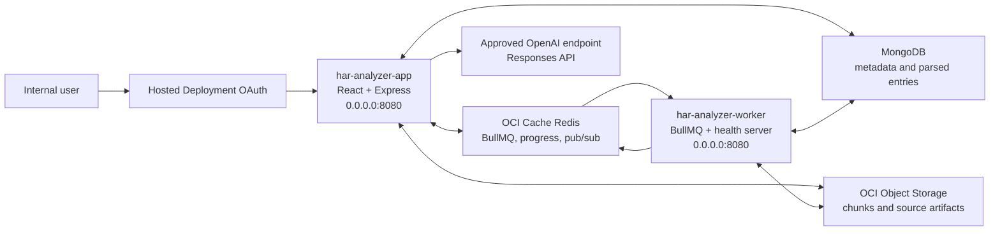
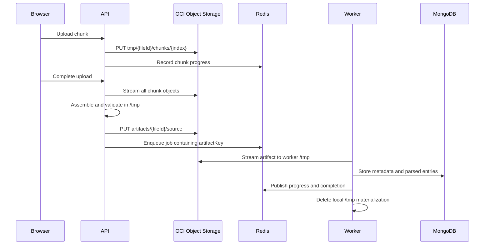

# OCI GenAI Hosted Deployment

## Purpose

This document defines the deployment contract for running HAR Analyzer in the OCI GenAI Hosted Deployment environment. The application retains MongoDB and Redis, uses OCI Object Storage for uploaded artifacts, and uses an approved OpenAI API key for optional AI-assisted analysis.

## Deployment Status

| Area | Repository status | External input still required |
| --- | --- | --- |
| Web/API runtime | Ready: combined frontend and API image listens on `0.0.0.0:8080` | Hosted Application, OAuth, DNS, and OCIR configuration |
| Worker runtime | Ready: worker image exposes health endpoints on `0.0.0.0:8080` | Separate Hosted Application or worker deployment |
| MongoDB | Supported and required | Approved reachable MongoDB connection string |
| Redis | Supports `REDIS_URL`, TLS, username, and password | OCI Cache Redis connection URI |
| File storage | OCI Object Storage adapter implemented | Namespace, bucket, resource-principal IAM policy, and lifecycle policy |
| AI | Optional: OpenAI Responses API implemented; deterministic fallback retained | None for initial deployment; GCGA-approved key, model, and egress can be added later |
| Image build | Reproducible Dockerfiles and Rancher Desktop build script included; application builds pass | Approved Oracle Artifactory, OCIR, or Oracle Container Registry Node base image and OCIR destination |

## Repository Validation

Validated on 2026-07-14 from branch `codex/genai-hosted-readiness`:

- Backend: 23 test files and 115 tests passed.
- Frontend: 36 test files and 285 tests passed.
- Frontend ESLint passed without warnings or errors.
- Backend TypeScript build passed.
- Frontend TypeScript and Vite production build passed.
- Root and backend production dependency audits both reported 0 vulnerabilities.
- Legacy OCA, browser-side AI, local-model, and unused vector retrieval runtime paths were removed.
- Git whitespace validation passed.

Public Docker Hub images are prohibited. The Dockerfiles have no public-registry default, and the build script rejects Docker Hub references. Supply an approved Oracle Artifactory, OCIR, or Oracle Container Registry Node base through `-NodeImage`, then complete the validation steps in this document before pushing an image to OCIR.

## Target Architecture



The frontend is served by the Express API image. This gives users one Hosted Application endpoint and keeps browser API, SSE, and Socket.IO traffic same-origin. The worker is deployed separately because it consumes BullMQ jobs continuously and must scale independently from HTTP traffic.

## Runtime Images

### Application image

- Dockerfile: `deploy/hosted/Dockerfile.app`
- Default command: `node dist/server.js`
- Process: React static assets, Express REST API, OpenAPI, SSE, and Socket.IO
- Listening address: `0.0.0.0:8080`
- Liveness: `GET /health`
- Readiness: `GET /ready`
- Runs as the non-root `node` user

### Worker image

- Dockerfile: `deploy/hosted/Dockerfile.worker`
- Default command: `node dist/worker.js`
- Process: BullMQ HAR and console-log workers
- Listening address: `0.0.0.0:8080` for health only
- Liveness: `GET /health`
- Readiness: `GET /ready`
- Runs as the non-root `node` user

Do not override either image command in Hosted Deployment. Do not configure a second application process inside either image.

## Artifact Flow

Hosted Deployment does not provide a writable shared filesystem. All durable and cross-container file exchange therefore uses Object Storage.



Only disposable scratch files are written locally. The images set `HOME`, `TMPDIR`, upload scratch, assembly scratch, sanitizer scratch, and worker scratch under `/tmp`.

## Required Configuration

### Shared by application and worker

| Variable | Value or source | Required |
| --- | --- | --- |
| `NODE_ENV` | `production` | Yes |
| `HOSTED_DEPLOYMENT` | `true` | Yes |
| `HOST` | `0.0.0.0` | Recommended; also the code default |
| `MONGODB_URL` | Secret containing the approved MongoDB URI | Yes |
| `REDIS_URL` | Secret containing the OCI Cache `redis://` or `rediss://` URI | Yes |
| `ARTIFACT_STORE` | `oci-object-storage` | Yes |
| `OCI_OBJECT_STORAGE_NAMESPACE` | OCI Object Storage namespace | Yes |
| `OCI_OBJECT_STORAGE_BUCKET` | Dedicated bucket name | Yes |
| `OCI_OBJECT_STORAGE_PREFIX` | `har-analyzer` | Recommended |
| `OCI_AUTH_MODE` | `resource-principal` | Yes in Hosted Deployment |

Do not set `REDIS_HOST`, `REDIS_PORT`, `REDIS_USERNAME`, `REDIS_PASSWORD`, or `REDIS_TLS` when a complete `REDIS_URL` is supplied.

### Application only

| Variable | Value or source | Required |
| --- | --- | --- |
| `OPENAI_API_KEY` | GCGA-managed secret | Required only for AI |
| `OPENAI_MODEL` | Exact model approved for the governed key | Required only for AI |
| `OPENAI_BASE_URL` | Omit for `https://api.openai.com/v1`, or use the approved HTTPS gateway | Optional |
| `CORS_ORIGIN` | Final Hosted Application origin if cross-origin access is needed | Environment-specific |
| `JSON_BODY_LIMIT` | `10mb`; HAR/log uploads use bounded multipart chunks instead | Recommended |
| `PUBLIC_API_URL` | Final public Hosted Application URL | Recommended |
| `OPENAPI_SERVER_URL` | Final public Hosted Application URL | Recommended |
| `RETENTION_CLEANUP_ENABLED` | `true` after retention policy approval | Production decision |
| `RETENTION_CLEANUP_DRY_RUN` | `true` for initial validation, then `false` | Production decision |

The OpenAI key is used only by the backend. It must not be injected into frontend build arguments or exposed through any `VITE_*` variable. API requests use the Responses API with `store: false`; deterministic analyzer evidence remains available when AI is not configured or fails.

### Initial deployment without OpenAI

The application can be deployed before a governed OpenAI key is available:

- Do not set `OPENAI_API_KEY`, `OPENAI_MODEL`, or `OPENAI_BASE_URL` to placeholder values; omit them.
- `GET /api/ai/status` reports `configured: false` with HTTP 200.
- The AI chat control is not rendered.
- Deterministic Insights and all HAR/log analyzer features remain available.
- OpenAI is an optional operations check and does not affect `/ready`.
- The same images can later enable OpenAI through backend secret injection without a frontend rebuild.

### Worker only

| Variable | Value or source | Required |
| --- | --- | --- |
| `WORKER_CONCURRENCY` | Start with `2`, then tune after load testing | Recommended |

Hosted Deployment supplies or reserves the runtime port. The application honors `PORT` when the platform injects it and otherwise uses `8080` when `HOSTED_DEPLOYMENT=true`. Do not hard-code ports `80`, `3000`, or `4000` in the Hosted Application configuration.

## OCI IAM and Storage

Create a dedicated private Object Storage bucket in the `har-analyzer` compartment. Associate both Hosted Application resource principals with a dynamic group or the platform-equivalent identity mapping.

The least-privilege policy must allow both runtimes to inspect the bucket and manage objects only in the selected bucket. The tenancy IAM team should translate the following intent into the approved local policy form:

```text
Allow dynamic-group <har-analyzer-runtime-group> to read buckets in compartment har-analyzer
Allow dynamic-group <har-analyzer-runtime-group> to manage objects in compartment har-analyzer where target.bucket.name='<har-analyzer-bucket>'
```

Configure an Object Storage lifecycle rule for stale objects under `har-analyzer/tmp/`. Application retention cleanup removes normal artifacts and stale chunks, while the bucket lifecycle rule provides a recovery control for interrupted uploads.

## Build with Rancher Desktop

Run from the repository root:

```powershell
$env:Path = "C:\nvm4w\nodejs;$env:Path"

npm ci
npm --prefix backend ci
npm run test
npm --prefix backend run test
npm run build
npm --prefix backend run build

powershell -ExecutionPolicy Bypass -File scripts/build-hosted-images.ps1 `
  -NodeImage <approved-oracle-registry>/<node-image>:<immutable-tag> `
  -AppImage bom.ocir.io/<namespace>/har-analyzer/har-app:<tag> `
  -WorkerImage bom.ocir.io/<namespace>/har-analyzer/har-worker:<tag>
```

The script builds `linux/amd64` images and fails if the resulting architecture is not `amd64`.

Push after authenticating Rancher Desktop to OCIR:

```powershell
docker push bom.ocir.io/<namespace>/har-analyzer/har-app:<tag>
docker push bom.ocir.io/<namespace>/har-analyzer/har-worker:<tag>
```

Use immutable release tags. Do not deploy `latest`.

## Deployment Validation

1. Deploy the application and worker images without command overrides.
2. Confirm both report `200` from `/health`.
3. Confirm both report `200` from `/ready` after MongoDB, Redis, and Object Storage initialize.
4. Open the application through the Hosted Deployment OAuth URL.
5. Upload one small HAR and one console log.
6. Confirm progress events arrive, the worker completes processing, and analyzer data loads.
7. Confirm Object Storage contains the final `artifacts/{fileId}/source` objects and no completed upload chunks remain.
8. Confirm AI returns an OpenAI-backed response when configured and deterministic fallback when the key is absent.
9. Restart the application and worker independently and repeat an upload to verify there is no shared-filesystem dependency.
10. Review `/api/ops/status`, application logs, worker logs, queue depth, and retention behavior.

## Inputs Required from the Platform Team

- Hosted Application creation rights for the application and worker runtimes.
- OCIR repositories and image-push access.
- Approved Oracle Artifactory, OCIR, or Oracle Container Registry path for the Node base image.
- Final OAuth application, internal URL, and DNS configuration.
- Confirmation that Socket.IO/WebSocket upgrades are supported by the Hosted Application ingress.
- Approved MongoDB endpoint reachable from both runtimes.
- OCI Cache Redis URI reachable from both runtimes.
- Object Storage namespace, bucket, lifecycle rule, and resource-principal IAM policy.
- GCGA OpenAI key, approved model ID, secret injection, and outbound HTTPS access.
- Central logging/monitoring destination and alert ownership.
- Approved retention period for uploaded diagnostic artifacts and parsed records.

## Release Gate

Do not promote the deployment to broad internal use until the end-to-end upload test passes in the target compartment, OAuth access is enforced, Object Storage and database retention are approved, production secrets are injected through the platform secret mechanism, and logs confirm that neither runtime attempts durable writes outside `/tmp`.
