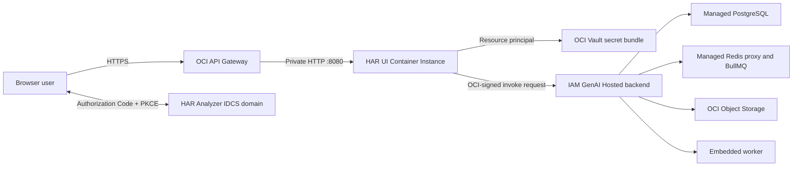

# HAR Analyzer OCI Deployment Runbook and Progress Record

Last updated: 2026-08-20<br>
Handling note: Oracle-internal deployment details; no secret values<br>
Primary compartment: `har-analyzer` in the `sostoolingdev` tenancy<br>
Region: US West (Phoenix), `us-phoenix-1`

## Purpose

This document is the durable source of truth for the HAR Analyzer OCI deployment. It records the working architecture, exact non-secret resource identifiers, deployment procedure, validation evidence, failures encountered, corrective actions, rollback path, and known constraints.

It intentionally contains no passwords, security tokens, OCIR auth tokens, private keys, OAuth client-secret value, database credentials, or OpenAI API key. The OAuth client-secret value is stored in OCI Vault and must never be copied into this document, source control, command history, Slack, or deployment JSON.

The older deployment records are retained later in this file because they explain how the architecture evolved. They are historical reference material and are not the current deployment procedure.

## Current Source of Truth

The browser-facing UI is now deployed as a private OCI Container Instance behind a public OCI API Gateway. The UI container performs IDCS Authorization Code authentication and uses its OCI resource principal to retrieve the OAuth client secret from Vault and sign requests to the IAM-protected GenAI Hosted backend.

The active design is a deliberate workaround for the regular GenAI Hosted Application OAuth feature not being generally available in this tenancy and region. The backend remains on GenAI Hosted Deployment because its IAM interface and managed PostgreSQL, Redis, and Object Storage integrations are working.

Use these files together:

| File | Purpose |
| --- | --- |
| [`deploy/oci/har-ui-container-instance.json`](../deploy/oci/har-ui-container-instance.json) | Current Container Instance definition and non-secret runtime configuration |
| [`deploy/oci/har-ui-api-gateway-spec.json`](../deploy/oci/har-ui-api-gateway-spec.json) | Current API Gateway route to the private container IP |
| [`deploy/oci/har-container-ui-runtime-policy-statements.json`](../deploy/oci/har-container-ui-runtime-policy-statements.json) | Minimum runtime policies for OCIR, Vault, and backend invocation |
| [`deploy/oci/har-private-subnet-route-rules.json`](../deploy/oci/har-private-subnet-route-rules.json) | Private-subnet NAT route |
| [`deploy/oci/har-ui-gateway-route-rules.json`](../deploy/oci/har-ui-gateway-route-rules.json) | Public gateway-subnet Internet Gateway route |
| [`deploy/hosted/Dockerfile.ui-container`](../deploy/hosted/Dockerfile.ui-container) | Current UI/session/proxy container image |
| [`deploy/hosted/Dockerfile.ui-overlay`](../deploy/hosted/Dockerfile.ui-overlay) | Release overlay used to replace the prebuilt UI assets without pulling a public base image |
| [`deploy/hosted/ui-server.mjs`](../deploy/hosted/ui-server.mjs) | Static UI server, IDCS session handling, and signed backend proxy |
| [`deploy/hosted/ui-auth-core.mjs`](../deploy/hosted/ui-auth-core.mjs) | OAuth/PKCE, token verification, state, and cookie helpers |
| [`deploy/hosted/ui-proxy-core.mjs`](../deploy/hosted/ui-proxy-core.mjs) | Backend endpoint validation, header filtering, and OCI signing helpers |
| [`docs/OCI_GENAI_HOSTED_DEPLOYMENT.md`](./OCI_GENAI_HOSTED_DEPLOYMENT.md) | Backend Hosted Deployment reference |

Do not use `deploy/oci/har-ui-runtime-route-rules.json` without replacing its service-gateway placeholder. The VM and Object Storage bootstrap files in `deploy/oci` are fallback artifacts, not the live Container Instance path.

## Current Architecture



The public gateway address is stable and is the OAuth callback origin. The Container Instance has no public IP. Its private IP is embedded in the API Gateway deployment specification, so recreating the Container Instance requires updating and redeploying the gateway specification.

The API Gateway is the TLS/network front door; it is not the OAuth session implementation. `ui-server.mjs` starts the IDCS Authorization Code + PKCE flow, verifies the returned ID token, creates the application session, and proxies allowed backend paths. The IDCS integrated application's Web tier policy is not on the request path for this deployment.

## Deployment Chronology and Decision Record

| Date | Event and decision |
| --- | --- |
| 2026-07-16 to 2026-07-17 | Proved the original multi-container topology in OCI, fixed Linux case sensitivity and wildcard CORS, and published the first Hosted-ready images. |
| 2026-07-22 onward | Created the first IAM Hosted Application and established that its invoke URL requires OCI-signed requests and cannot be opened as a normal browser application. |
| 2026-07-30 to 2026-07-31 | OCI-signed health invocation reached the backend. PostgreSQL startup configuration was corrected; managed Redis still failed through `127.0.0.1:6379`. |
| 2026-08-03 to 2026-08-04 | GenAI team confirmed that `127.0.0.1:6379` is the managed Redis proxy. Removed contradictory `REDIS_TLS`, used injected `REDIS_URL`, added startup retries, and isolated missing Redis ACL commands. |
| 2026-08-04 to 2026-08-07 | Redis Pub/Sub ACL fix was tracked under GARP-475 and deployed in PHX. A newly created backend received the fix; the old application did not. BullMQ `INFO` version probing was disabled for the managed runtime. |
| 2026-08-05 to 2026-08-06 | Proved that a separate UI Hosted Application can serve assets and its resource principal can reach and sign a backend request after invoke policy was added. |
| 2026-08-07 | New backend `/health` and `/ready` became fully green for PostgreSQL, Redis, both queues, Object Storage, and the embedded worker. |
| 2026-08-07 to 2026-08-11 | Created the IDCS domain, confidential application, Vault secret, dynamic-group rules, and policies. Repeated regular Hosted Application creation attempts returned the same service-side OAuth `NotAllowed` response. |
| 2026-08-11 | GenAI team confirmed that the Hosted OAuth feature was not GA. The team approved the Container Instance plus IDCS workaround so the browser application would not remain blocked. |
| 2026-08-12 | Built and published the IDCS UI image with Rancher Desktop, created a private Container Instance, and connected it through API Gateway. E4 quota exhaustion required switching to the generic x86 shape. |
| 2026-08-12 to 2026-08-13 | Corrected the IDCS client identifier and enabled signing-certificate client access. End-to-end sign-in, UI rendering, HAR upload, and request analysis succeeded. |
| 2026-08-16 | Published the same-origin runtime URL fix, created a new private Container Instance, verified its container health, and cut both API Gateway routes over to the new private IP. The prior working instance was retained as the immediate rollback target. |
| 2026-08-18 | Published the unified chronological HAR/console file-tab UI, created a new private Container Instance, verified `ACTIVE`/`CONTAINER_RUNNING`/`HEALTHY` with zero restarts, and cut both API Gateway routes over to `10.240.2.224:8080`. The 2026-08-16 instance at `10.240.2.173:8080` was retained as the immediate rollback target. |
| 2026-08-18 | Corrected production HAR uploads by allowing the browser to generate the multipart boundary, preserving the safe backend error detail in the UI, and copying the overlay bundle into the runtime's actual `/app/public` static directory. Published `container-ui-uploadfix-20260818-01`, created a parallel healthy Container Instance, and cut both gateway routes to `10.240.2.213:8080`. The file-tab instance at `10.240.2.224:8080` is now the immediate rollback target. |
| 2026-08-18 | Corrected a second production upload blocker: `.env.production` embedded the legacy HTTP VM endpoint `10.65.39.163:4000`, so the HTTPS browser was prevented by CSP from sending chunks. Production URLs are now same-origin, the runtime resolver rejects insecure production overrides, and the bundle validator/tests guard against regression. Published `container-ui-uploadroute-20260818-02`, created a healthy parallel Container Instance, and cut both gateway routes to `10.240.2.181:8080`. The prior upload-fix instance at `10.240.2.213:8080` is retained as the immediate rollback target. |
| 2026-08-18 | Unified the former top-level HAR and Console entries under one `Analyzer` entry while preserving evidence-type routing inside the workspace and retaining Compare and Sanitizer. Published `container-ui-analyzer-20260818-01`, created a healthy parallel Container Instance, and cut both gateway routes to `10.240.2.241:8080`. The upload-route instance at `10.240.2.181:8080` is retained as the immediate rollback target. |
| 2026-08-18 | Published the HAR workspace performance release with retained HAR payload/search-index reuse and virtualized request rendering, created a healthy parallel Container Instance, and cut both gateway routes to `10.240.2.246:8080`. The Analyzer instance at `10.240.2.241:8080` is retained as the immediate rollback target. |
| 2026-08-18 | Published the progressive HAR preview release. The browser now extracts metadata and the earliest request rows in a worker while the compressed chunk upload continues, then atomically replaces the provisional preview with the backend's canonical result. Published `container-ui-progressive-preview-20260818-01`, created a healthy parallel Container Instance, and cut both gateway routes to `10.240.2.87:8080`. The performance instance at `10.240.2.246:8080` is retained as the immediate rollback target. |
| 2026-08-19 | Published the Request Flow sidebar and incremental-loading preview refinements as `container-ui-flow-preview-20260819-01`. Created and verified a healthy parallel private Container Instance, then cut both existing API Gateway routes to `10.240.2.238:8080`. The progressive-preview instance at `10.240.2.87:8080` remains active as the immediate rollback target; the GenAI Hosted backend was not changed. |
| 2026-08-19 | Published the large-HAR loading resilience release as `container-ui-largehar-fix-20260819-01`. Large authoritative HAR downloads now use a scoped timeout, deterministic completion failures stop promptly instead of retrying to the assembly deadline, and the CSP-owned theme/font warnings were removed. Created a healthy private replacement and cut both gateway routes to `10.240.2.38:8080`; the flow-preview instance at `10.240.2.238:8080` remains active as immediate rollback. The GenAI Hosted backend was not changed. |
| 2026-08-20 | Published the invalid-HAR preview edge-case release. The browser now cancels malformed uploads and removes failed provisional tabs, while oversized preview entries remain nonfatal; the backend now records deterministic terminal validation failures and stops status polling. Activated combined backend artifact `combined-invalid-har-fix-20260820-01`, created a healthy private UI Container Instance, and cut both gateway routes to `10.240.2.114:8080`. The prior backend artifact and the large-HAR UI instance at `10.240.2.38:8080` remain available for rollback. |

## OCI Console Navigation Map

| Task | Console navigation |
| --- | --- |
| Container Instance | Developer Services -> Containers & Artifacts -> Container Instances |
| OCIR image/tag | Developer Services -> Containers & Artifacts -> Container Registry -> `har-analyzer/har-app` |
| API Gateway and deployment | Developer Services -> API Management -> Gateways -> gateway -> Deployments |
| Identity domain and OAuth app | Identity & Security -> Domains -> `har-analyzer-domain` -> Integrated applications |
| Signing-certificate access | Identity domain -> Settings -> Access signing certificate |
| Resource dynamic group | Identity & Security -> Domains -> tenancy/default domain -> Dynamic groups |
| Runtime IAM policy | Identity & Security -> Policies -> compartment `har-analyzer` |
| Vault secret | Identity & Security -> Vault -> `har-analyzer-vault` -> Secrets |
| Routes/security lists | Networking -> Virtual cloud networks -> VCN -> Route tables / Security lists / Subnets |
| Service limits | Governance & Administration -> Limits, Quotas and Usage |
| Container logs | Observability & Management -> Logging -> Logs, using the configured Container Instance log |
| Gateway logs | Developer Services -> API Management -> gateway/deployment logs or Observability & Management -> Logging |

## Current Resource Inventory

The following values are non-secret identifiers. The backend activation, replacement Container Instance, and gateway cutover were verified during the 2026-08-20 release. Recheck lifecycle state before a future change because operator security-token profiles expire independently of the deployed service.

| Resource | Current or last observed value | Status/evidence |
| --- | --- | --- |
| Tenancy | `sostoolingdev` | Target tenancy used for the deployment |
| Compartment | `ocid1.compartment.oc1..aaaaaaaaxqizjc3kmis32okxspg62qfchiwtp5t6psbhiuelssobbstys36a` | `har-analyzer` |
| Public UI base URL | `https://jxc7ntykekeecmlifn4ijizsmi.apigateway.us-phoenix-1.oci.customer-oci.com` | Browser UI and OAuth callback origin |
| API Gateway | `ocid1.apigateway.oc1.phx.amaaaaaaxlowriqaztxk65z4jximz5txmiep5ypwr66ynrfz4fzbohfq2bga` | Last observed active |
| API deployment | `ocid1.apideployment.oc1.phx.amaaaaaaxlowriqakyponrxfwtvtfdn3sm7jd6kmcuj7nnxuke7ngb7khi5q` | Last observed active |
| Current Container Instance | `ocid1.computecontainerinstance.oc1.phx.anyhqljrxlowriqaksfhppn2q7w2hhs2r3yav225a3msoeh3godsemaimgia` | `ACTIVE`; invalid-HAR preview edge-case release |
| Current container | `ocid1.computecontainer.oc1.phx.anyhqljrxlowriqatntzblwpgmlft57ftwxshovbdxssoegyesjxgy56lu5a` | `CONTAINER_RUNNING`, health `HEALTHY`, restart count 0 at and after cutover |
| Current VNIC | `ocid1.vnic.oc1.phx.abyhqljrjyraa4mbgcafflb5ls5fxtavqahuzgjbfvgochp2oshpnrlhuzoa` | No public IP; hostname `harui820ih1` |
| Current private target | `10.240.2.114:8080` | Read back from both live gateway routes after the 2026-08-20 cutover |
| Immediate rollback Container Instance | `ocid1.computecontainerinstance.oc1.phx.anyhqljrxlowriqayo5eno3wx3wrjhoedx42rxhnkqyhsv3ussxpawimnkiq` | Prior healthy large-HAR release; retained active during the observation window |
| Immediate rollback container | `ocid1.computecontainer.oc1.phx.anyhqljrxlowriqawkupailobm46e5bbteunwi3k333j2l46t4vselljhtoa` | Prior container was healthy with zero restarts at its cutover |
| Immediate rollback VNIC | `ocid1.vnic.oc1.phx.abyhqljreblz2hsqi53hhxrwsjeg2t7on2eqn3d6ok5t2dgrdo7nfrh6ugza` | No public IP; hostname `harui819lh1` |
| Immediate rollback private target | `10.240.2.38:8080` | Prior working large-HAR target |
| Prior rollback Container Instance | `ocid1.computecontainerinstance.oc1.phx.anyhqljrxlowriqanxqodoigr7ght4gmqxcqtcmvws2dgirbypgecy2ycu4a` | Prior healthy flow-preview release |
| Prior rollback private target | `10.240.2.238:8080` | Earlier rollback target |
| Older rollback Container Instances | `ocid1.computecontainerinstance.oc1.phx.anyhqljrxlowriqa6y7x24biqt5jmvp3p3dasw2dsl66z3zsjc6o55selqca`; `ocid1.computecontainerinstance.oc1.phx.anyhqljrxlowriqae2j2wzamea6utac55qwig5t2oyeqrwgzjbfp3v6rxpoa`; `ocid1.computecontainerinstance.oc1.phx.anyhqljrxlowriqaiwb7vgyfgbfishcgc7e5gqyqwbwdhey73nbv75jvl7da`; `ocid1.computecontainerinstance.oc1.phx.anyhqljrxlowriqasqabcinyj6gvsivqz3exfl72rdj674sskuz42d5fur3a` | Earlier healthy releases retained at `10.240.2.246:8080`, `10.240.2.181:8080`, `10.240.2.213:8080`, and `10.240.2.224:8080` |
| Container subnet | `ocid1.subnet.oc1.phx.aaaaaaaaoktighadnrpqp3zgftvkbianfqqvxn7x7mhubp5yp6u4efekmska` | Private subnet; no public IP on the container |
| Private-subnet NAT gateway | `ocid1.natgateway.oc1.phx.aaaaaaaajowt3domsaaaesa6rjxfrmz7ygj5b75uyc4ynu5xney6ioxl3jrq` | Provides outbound access from private runtime subnet |
| Gateway-subnet Internet Gateway | `ocid1.internetgateway.oc1.phx.aaaaaaaax6gpnthwxc22kv4oljtcrmq55y3ygevpp6xktvmd5f3wqk4b7vua` | Public gateway path |
| UI image | `phx.ocir.io/axfm33dl0mwg/har-analyzer/har-app:container-ui-invalid-har-fix-20260820-01` | Linux/AMD64 UI-overlay image used by the current manifest |
| UI image digest | `sha256:837575668f3ceb72f9aef523b8ae0514bb2929f9b9091cfa2013a62766b8aebf` | Immutable digest returned by the successful OCIR push |
| IDCS domain | `har-analyzer-domain` | Free identity domain in Phoenix |
| IDCS domain URL | `https://idcs-4c25395e789648a1ae24218030f05d0a.identity.oraclecloud.com` | Issuer/login origin |
| IDCS confidential app | `har-analyzer-ui-session` | Browser-session OAuth client |
| Correct OAuth client ID | `818a47b17c3e4aaa9cd298604cccf6b1` | Do not replace with the console Application ID |
| Console Application ID | `c6780d8c6214448188e8ca54483e5147` | Informational; using it as the OAuth client ID caused `invalid_client` |
| Vault secret | `ocid1.vaultsecret.oc1.phx.amaaaaaaxlowriqa5inij7bspp4nc5cjornp6a6xrgsbkpuovqpqq2ragkgq` | Secret name `har-analyzer-idcs-client-secret`; value is not recorded here |
| Backend application | `ocid1.generativeaihostedapplicationiam.oc1.phx.amaaaaaaxlowriqaudnn2rer2bthxhaof5c2rzj3fa4nkotky7znbqmidyrq` | New backend created after the PHX Redis ACL fix |
| Backend Hosted Deployment | `ocid1.generativeaihosteddeployment.oc1.phx.amaaaaaaxlowriqakg4yowsosvqgcrwmlcalwnsrmv2vj27d4iu3427cjgsq` | `ACTIVE`; current artifact ID `48824` |
| Backend image | `phx.ocir.io/axfm33dl0mwg/har-analyzer/har-app:combined-invalid-har-fix-20260820-01` | Combined API plus embedded worker overlay |
| Backend image digest | `sha256:6b3b7ec58a65fed0330e8334af943fbbc35eb0737130fbcec606e46d90608646` | Immutable digest returned by the successful OCIR push |
| Backend rollback artifact | `combined-20260807-01`, artifact ID `45572` | Retained `INACTIVE` for immediate activation rollback |
| Backend invoke base | `https://inference.generativeai.us-phoenix-1.oci.oraclecloud.com/20251112/hostedApplicationsIam/ocid1.generativeaihostedapplicationiam.oc1.phx.amaaaaaaxlowriqaudnn2rer2bthxhaof5c2rzj3fa4nkotky7znbqmidyrq/actions/invoke` | Used only by the server-side signed proxy |
| Superseded backend | `ocid1.generativeaihostedapplicationiam.oc1.phx.amaaaaaaxlowriqaoliwy6cq3fylgdbltob7p5gsvybwcsvrbmob7izpgrgq` | Do not use; it retained the old Redis ACL behavior |

## Working Runtime Configuration

The checked-in Container Instance manifest is configured as follows:

| Setting | Working value | Reason |
| --- | --- | --- |
| Availability domain | `ZSEf:PHX-AD-1` | Validated deployment location |
| Shape | `CI.Standard.x86.Generic` | Avoided the exhausted E4-specific quota and matches the AMD64 image |
| Resources | 1 OCPU, 2 GB memory | Sufficient for the single UI/session/proxy container proof of concept |
| Restart policy | `ALWAYS` | Restarts the process after failure |
| Container health path | `/health` on port 8080 | Public, non-sensitive liveness endpoint |
| Health timing | 15-second initial delay, 30-second interval, 5-second timeout, 3 failures | Current manifest values |
| Failure action | `KILL` | Lets the Container Instance restart an unhealthy container |
| Public IP | Disabled | Browser traffic must enter through API Gateway |
| `AUTH_MODE` | `idcs` | Enables server-side IDCS session flow |
| `OCI_AUTH_MODE` | `resource-principal` | Retrieves the Vault secret and signs backend calls without a user key |
| `IDCS_SCOPES` | `openid profile email` | Minimum current browser identity scopes |
| `OCI_REGION_FALLBACK` | `us-phoenix-1` | Required because the runtime region variable was not consistently present |
| `PORT` | `8080` | Container and gateway target port |
| Proxy body limit | 16 MiB by image default | Bounds buffered request bodies in the UI proxy |
| UI proxy timeout | 30 minutes by image default | Application-side maximum; the gateway timeout below is shorter |
| API Gateway connect timeout | 10 seconds | Current gateway specification |
| API Gateway read/send timeout | 300 seconds | Effective request ceiling through the public gateway is approximately 5 minutes |

The actual OAuth secret is not passed as plaintext environment data. Only its Vault OCID is supplied. The container retrieves the current secret bundle with its resource principal during startup.

## Identity, Policy, and Network Prerequisites

### Container dynamic group

Create or retain `har-container-ui-dg` in the tenancy's default identity domain. It must match Container Instances in the HAR Analyzer compartment. The intended rule is:

```text
ALL {resource.type = 'computecontainerinstance', resource.compartment.id = 'ocid1.compartment.oc1..aaaaaaaaxqizjc3kmis32okxspg62qfchiwtp5t6psbhiuelssobbstys36a'}
```

Do not look for this dynamic group inside `har-analyzer-domain`; resource-principal dynamic groups are tenancy/default-domain resources. The custom `har-analyzer-domain` is for end-user sign-in.

### Runtime policies

Apply the statements in `deploy/oci/har-container-ui-runtime-policy-statements.json` in the `har-analyzer` compartment:

```text
Allow dynamic-group har-container-ui-dg to read repos in compartment har-analyzer where target.repo.name = 'har-analyzer/har-app'
Allow dynamic-group har-container-ui-dg to read secret-bundles in compartment har-analyzer where target.secret.id = 'ocid1.vaultsecret.oc1.phx.amaaaaaaxlowriqa5inij7bspp4nc5cjornp6a6xrgsbkpuovqpqq2ragkgq'
Allow dynamic-group har-container-ui-dg to {GENERATIVE_AI_HOSTED_DEPLOYMENT_INVOKE} in compartment har-analyzer
```

These permissions cover image pull, Vault secret retrieval, and server-to-server backend invocation. The broader earlier policy `Allow dynamic-group har-genai-hosted-dg to read secret-family in compartment har-analyzer` helped diagnose the Hosted Application path, but it should not replace the Container Instance-specific minimum policy above.

Policy propagation is not instantaneous. After changing a dynamic-group rule or policy, allow several minutes and create/restart a runtime only after propagation where practical.

### IDCS confidential application

The required settings are:

```text
Client type: Confidential
Grant type: Authorization code
Scopes: openid profile email
Redirect URL: https://jxc7ntykekeecmlifn4ijizsmi.apigateway.us-phoenix-1.oci.customer-oci.com/auth/callback
Post-logout redirect URL: https://jxc7ntykekeecmlifn4ijizsmi.apigateway.us-phoenix-1.oci.customer-oci.com/
```

The container generates PKCE S256 parameters even though the IDCS application is confidential. Keep the redirect URL byte-for-byte identical to the public gateway callback. A changed gateway hostname requires updating IDCS before users can sign in.

The current implementation performs OAuth directly in the UI container. Creating or configuring an IDCS Web tier policy is not required for the live API Gateway path unless the architecture is deliberately changed to use an IDCS App Gateway/Web tier agent.

In the identity domain, enable:

```text
Settings -> Access signing certificate -> Configure client access
```

Without this setting, the runtime cannot read the signing JWKS needed to verify ID tokens. The symptom was a successful login followed by `Authentication could not be completed`, while `/admin/v1/SigningCert/jwk` returned HTTP 401.

The new identity domain is not automatically federated with the employee `ocna-saml` provider used to enter the OCI Console. Until federation is configured, users need an account in `har-analyzer-domain` and must set/reset its local password. This is a user-lifecycle constraint, not a HAR Analyzer application failure.

### Network path

The required direction is:

1. Internet to API Gateway over TCP 443.
2. API Gateway subnet to the private Container Instance subnet over TCP 8080.
3. Private Container Instance subnet outbound through the NAT gateway for IDCS, Vault, OCIR, and GenAI service endpoints.
4. No direct public ingress to the Container Instance.

The checked-in security-list intent is:

| Security list | Ingress | Egress |
| --- | --- | --- |
| Gateway subnet | TCP 443 from `0.0.0.0/0` | TCP 8080 to `10.240.2.0/24` |
| Runtime subnet | TCP 8080 from gateway subnet `10.240.3.0/24` | Required outbound through the private route/NAT path |

The gateway deployment currently sends both `/` and `/{wildcard*}` to `http://10.240.2.114:8080`. Do not expose the backend Hosted invoke endpoint directly to the browser; normal browser calls cannot produce OCI request signatures.

## Rebuild and Publish Procedure

Use Rancher Desktop with its Docker-compatible/Moby engine on the workstation. Docker Desktop is not required and Docker Hub is restricted in the Oracle environment. The runtime image must be in private OCIR before Container Instances can pull it.

The current Dockerfile starts from `node:22-bookworm-slim` and installs `oci-common@2.136.1` during the image build. This means the local build still needs access to the base image and npm package source. If those public sources are blocked, mirror/prefetch them through an approved Oracle source before building; the deployed runtime itself pulls only from OCIR.

From the repository root:

```powershell
$env:VITE_API_URL = "."
$env:VITE_BACKEND_URL = "."
$env:VITE_WS_URL = "."
$env:VITE_WS_TRANSPORTS = "polling"

npm ci
npm run build

$tag = "container-ui-idcs-YYYYMMDD-NN"
$image = "phx.ocir.io/axfm33dl0mwg/har-analyzer/har-app:$tag"

docker build `
  --platform linux/amd64 `
  --file deploy/hosted/Dockerfile.ui-container `
  --tag $image `
  .

docker push $image
```

Before publication, run:

```powershell
npm run test:hosted-ui-proxy
npm run build
docker image inspect $image
```

For the 2026-08-18 and 2026-08-19 UI-only releases, Docker Hub access was restricted but the approved OCI UI image was already present locally and in OCIR. The releases therefore used `Dockerfile.ui-overlay` with the current OCI UI image as the base. The overlay must clear `/app/public` before copying the verified frontend bundle there; otherwise obsolete hashed assets remain addressable even though the new `index.html` does not reference them. `STATIC_DIR=/app/public` is the directory served by `ui-server.mjs`; copying only to `/app/dist` silently leaves the previous browser bundle active. Use this overlay only when the remaining server dependencies are intentionally unchanged; rebuild with `Dockerfile.ui-container` when Node dependencies change.

Record the immutable registry digest after the push and replace the tag in `deploy/oci/har-ui-container-instance.json`. A future release should preferably pin the digest as well as recording the human-readable tag.

Do not paste the OAuth client-secret value into the manifest. When rotating the secret, create a new Vault secret version and restart the Container Instance so startup retrieves the current version.

## Create or Replace the Container Instance

### 1. Authenticate the OCI CLI

Security-token profiles expire. Create or refresh a profile in Phoenix and validate it before continuing:

```powershell
oci session authenticate --region us-phoenix-1

oci session validate `
  --profile <PROFILE> `
  --auth security_token `
  --region us-phoenix-1
```

An expired token is an operator-session issue. It does not imply that the live Container Instance is unhealthy.

### 2. Confirm the manifest

Before creation, verify:

- Image tag is the intended immutable release.
- Shape is `CI.Standard.x86.Generic` unless limits have been rechecked.
- Architecture is Linux/AMD64.
- Subnet is private and `assignPublicIp` is `false`.
- Correct OAuth client ID is used.
- Vault OCID is present, but no secret value is present.
- Backend URL points to the new healthy backend OCID.
- Public base URL is the stable API Gateway origin.

### 3. Create the Container Instance

```powershell
oci container-instances container-instance create `
  --profile <PROFILE> `
  --auth security_token `
  --region us-phoenix-1 `
  --from-json file://deploy/oci/har-ui-container-instance.json `
  --wait-for-state SUCCEEDED `
  --max-wait-seconds 1200
```

Do not delete the old Container Instance at this point. OCI assigns a new private IP when the replacement is created, and the old target is the immediate rollback path.

### 4. Resolve the new private IP

Read the new Container Instance, VNIC, and private IP from OCI Console or CLI. Update every backend URL in `deploy/oci/har-ui-api-gateway-spec.json`:

```text
http://<NEW_PRIVATE_IP>:8080
```

Do not reuse any recorded address blindly. The active 2026-08-20 target is `10.240.2.114`, the retained immediate rollback large-HAR target is `10.240.2.38`, and earlier rollback targets include `10.240.2.238`, `10.240.2.87`, `10.240.2.246`, `10.240.2.241`, `10.240.2.181`, `10.240.2.213`, and `10.240.2.224`. Any address may change when its Container Instance is recreated.

### 5. Update the API Gateway deployment

Update the existing API deployment using the revised specification and wait until it is active. In the Console, navigate to:

```text
Developer Services -> API Management -> Gateways -> HAR Analyzer gateway -> Deployments -> Edit
```

Supply the updated API specification, keep request and execution logging enabled, and confirm that both the root and wildcard routes point to the new private IP. The public gateway URL and IDCS callback should not change during this operation.

### 6. Validate before cleanup

Run the acceptance checklist below. Delete or stop the rollback Container Instance only after the new target has remained healthy through the agreed observation window.

## Acceptance and Regression Checklist

### Automated local checks

On 2026-08-13, the focused authentication/proxy suite passed all 11 tests:

```powershell
node --test `
  deploy/hosted/ui-auth-core.test.mjs `
  deploy/hosted/ui-proxy-core.test.mjs
```

The tests cover:

- PKCE verifier/challenge generation.
- Safe return-path normalization.
- Secure, HttpOnly, SameSite session cookies.
- RS256 token signature and claim validation.
- Exact Hosted invoke endpoint restrictions.
- Path and query-string preservation.
- Removal of browser credential and forwarding headers.
- Safe response-header copying.
- Rejection of cross-site mutating requests.
- Byte-exact payload hashes for OCI signing.

Run the complete repository build and test suites before a production release; the focused suite is not a substitute for full application regression and image scanning.

### Live smoke tests

Perform these in order:

1. `GET <public-base>/health` returns HTTP 200 and reports `role=ui`, `authMode=idcs`, `ociAuthMode=resource-principal`, and `backendConfigured=true`.
2. An unauthenticated `GET /` redirects to IDCS.
3. IDCS login returns to `/auth/callback` and establishes the secure session cookie.
4. The application shell and hashed JS/CSS assets load through API Gateway.
5. Upload a small non-sensitive HAR and verify the Analyzer table and request-detail panel.
6. Verify Request Flow and Scorecard.
7. Verify filtering by HTTP status and search text.
8. Verify request, response, request-header, and response-header details.
9. Verify sanitization with a synthetic fixture containing representative secrets; never use a real credential as a test string.
10. Verify logout, a second login, and an incognito/no-cookie session.
11. Restart the Container Instance and confirm `/health`, login, and a new upload recover.
12. Validate an unsupported or malformed file fails cleanly without leaking content.
13. Validate a representative large HAR remains below the 16 MiB UI-proxy body limit per request/chunk and below the 300-second API Gateway timeout.

### Verified deployment evidence

As of 2026-08-13:

| Check | Result |
| --- | --- |
| Public gateway and IDCS login | Passed after the signing-certificate setting was enabled |
| Browser callback/session establishment | Passed |
| UI static assets | Passed |
| HAR upload and analysis | Passed with a 34-request HAR; Analyzer list, filters, and request details rendered |
| Focused auth/proxy tests | 11/11 passed |
| Backend `/health` | Previously validated HTTP 200 on the new backend |
| Backend `/ready` | Previously validated HTTP 200/green for PostgreSQL, Redis, HAR queue, console-log queue, Object Storage, and embedded worker |
| OpenAI | Optional warning when `OPENAI_API_KEY` or model is not configured; does not block deterministic HAR analysis |
| Current OCI lifecycle refresh | Not rerun on 2026-08-13 because the local security-token profile expired; refresh using the procedure above |
| 2026-08-16 replacement Container Instance | `ACTIVE`; container `CONTAINER_RUNNING`; health `HEALTHY`; restart count 0 before gateway cutover |
| 2026-08-16 API Gateway cutover | Work request `ocid1.apiworkrequest.oc1.phx.amaaaaaaxlowriqa7fert7wjc37tfoa5zqbrrxwvn7dpdk6buigq22kym7ya` reached `SUCCEEDED` at `2026-08-16T14:07:00.500Z` |
| 2026-08-16 browser recheck | Existing authenticated tab rendered the application before reload; reload required a new IDCS login, so post-cutover authenticated upload testing remains intentionally pending |
| 2026-08-18 local release checks | `test:hosted-ui-proxy` passed 18/18; focused `src/App.test.tsx` passed 19/19; same-origin production build passed and emitted `index-CBmi40CK.css` plus `index-EF2IDyA1.js` |
| 2026-08-18 replacement Container Instance | `ACTIVE`; container `CONTAINER_RUNNING`; health `HEALTHY`; restart count 0; image tag and digest match this runbook |
| 2026-08-18 Container Instance creation | Work request `ocid1.computecontainerworkrequest.oc1.phx.abyhqljr4yvn6dfu5ylqb6wzastoojeofalmidwr5dkvzdgxgr4fq6e3yvsq` reached `SUCCEEDED` |
| 2026-08-18 API Gateway cutover | Work request `ocid1.apiworkrequest.oc1.phx.amaaaaaaxlowriqa2gnzit7qdazutekew3amsvcgdn634r4a4527esr7klpq` reached `SUCCEEDED` at `2026-08-18T08:38:58.464Z` |
| 2026-08-18 public browser automation | The automated browser client returned `net::ERR_BLOCKED_BY_CLIENT` before an application response. OCI health and gateway work requests remained green; refresh the public URL in an authenticated user browser and complete the feature smoke test manually before deleting the rollback instance. |
| 2026-08-18 upload-fix local checks | Chunked uploader tests passed 2/2; hosted UI proxy tests passed 18/18; focused backend upload-route test passed 1/1; production build passed |
| 2026-08-18 upload-fix Container Instance | `ACTIVE`; container `CONTAINER_RUNNING`; health `HEALTHY`; restart count 0; image digest `sha256:baeeebaf7e4bf8eab40d96a619af460885d904f43440531e09242ee740f0daab` |
| 2026-08-18 upload-fix API Gateway cutover | Work request `ocid1.apiworkrequest.oc1.phx.amaaaaaaxlowriqavc2lltbltf6v4j67fquk2cwrcxjtd6lglez5m4eru27q` reached `SUCCEEDED` at `2026-08-18T09:42:48Z`; readback showed both routes targeting `10.240.2.213:8080` |
| 2026-08-18 post-cutover browser check | A fresh automated browser reached the expected `har-analyzer-domain` IDCS sign-in page. Final authenticated HAR upload verification remains a manual check in an existing signed-in browser session. |
| 2026-08-18 upload-route local checks | Runtime URL and chunked-uploader tests passed 12/12; hosted UI proxy tests passed 18/18; production build and executable-JavaScript endpoint scan passed with no legacy VM or localhost API endpoint |
| 2026-08-18 upload-route Container Instance | Work request `ocid1.computecontainerworkrequest.oc1.phx.abyhqljrcxrsy6amxpgxgxvw3sxfi5re2seieiysrfk2w2teiva3jvpoed3a` reached `SUCCEEDED`; instance is `ACTIVE`, container `CONTAINER_RUNNING`, health `HEALTHY`, restart count 0; image digest `sha256:dc0f20e24efc9ff68e29aeea2708c3af6b622e7218f5e7d6c4defd057c1d9671` |
| 2026-08-18 upload-route API Gateway cutover | Work request `ocid1.apiworkrequest.oc1.phx.amaaaaaaxlowriqai4pszwtk2qjeh6b355b3qp3o4r3t2js35gd4bvwb2exq` reached `SUCCEEDED` at `2026-08-18T10:57:27.736Z`; live readback showed both routes targeting `10.240.2.181:8080` |
| 2026-08-18 upload-route public smoke | Public `/health` returned HTTP 200 with `{"status":"ok","role":"ui"}`; public root returned the expected IDCS sign-in form. Final authenticated HAR upload verification remains a manual browser check before the rollback instance is removed. |
| 2026-08-18 Analyzer local checks | Focused `src/App.test.tsx` passed 19/19; hosted UI proxy tests passed 18/18; production build and endpoint validation passed |
| 2026-08-18 Analyzer Container Instance | Work request `ocid1.computecontainerworkrequest.oc1.phx.abyhqljrqvnjhogn3g66rqk4thekk6u46mx3a3ftidgyspvmiy6wduttqbaa` reached `SUCCEEDED`; instance is `ACTIVE`, container `CONTAINER_RUNNING`, health `HEALTHY`, restart count 0; image digest `sha256:369b7a98ad18260c6e41a26417c3ce0bb336632ed7cd280d0200c8bf157aaed6` |
| 2026-08-18 Analyzer API Gateway cutover | Work request `ocid1.apiworkrequest.oc1.phx.amaaaaaaxlowriqaawlfz6flmlglrthuj7eldkrndetaljtzzlmoci42iica` reached `SUCCEEDED` at `2026-08-18T11:31:55Z`; both routes target `10.240.2.241:8080` |
| 2026-08-18 Analyzer browser acceptance | Pending manual authenticated refresh because the connected Chrome session was unavailable to the deployment task and the isolated client could not reach the corporate public gateway. Confirm one top-level `Analyzer` entry, no separate HAR/Console entries, and successful HAR plus console-log routing before deleting rollback resources. |
| 2026-08-18 performance local checks | Full `npm run test` passed 44 files/321 tests; hosted UI proxy suite passed 18/18; same-origin production build and executable endpoint validation passed; emitted `index-B9en2oo0.css` and `index-pDicFz4R.js` |
| 2026-08-18 performance Container Instance | Work request `ocid1.computecontainerworkrequest.oc1.phx.abyhqljrx6r3t5m646x55bexqul5kacr6jkd56gx7d4hpowz2s3v4i6ljtma` reached `SUCCEEDED`; instance is `ACTIVE`, container `CONTAINER_RUNNING`, health `HEALTHY`, restart count 0; image digest `sha256:183d64827a34db27ab3d503693c444264e1e7c58022025d1c6f2b6fe7aa72fe6` |
| 2026-08-18 performance API Gateway cutover | Work request `ocid1.apiworkrequest.oc1.phx.amaaaaaaxlowriqav7a6mwkt7yr7vz57il2uvp6p2hossoe2mujdljdcq7lq` reached `SUCCEEDED` at `2026-08-18T12:44:41.972Z`; live readback showed both routes targeting `10.240.2.246:8080` |
| 2026-08-18 performance public smoke | Public `/health` returned HTTP 200 with `{"status":"ok","role":"ui"}` and public root returned the expected HTTP 302 authentication redirect. Authenticated large-HAR scrolling and cross-tab cache reuse remain manual browser checks before rollback resources are removed. |
| 2026-08-18 progressive-preview local checks | Focused progressive-preview and chunked-uploader suites passed 9/9; ESLint passed; the same-origin production build passed and emitted worker `harPreview.worker-B4_NrtCP.js`, CSS `index-DehVjCek.css`, and JavaScript `index-DvZS6jm4.js` |
| 2026-08-18 progressive-preview Container Instance | Work request `ocid1.computecontainerworkrequest.oc1.phx.abyhqljrvtrdzbroube2zrdcoxkmkhhban5i2m4hecsj6afcrqbdq6xu5dcq` reached `SUCCEEDED`; instance is `ACTIVE`, container `CONTAINER_RUNNING`, health `HEALTHY`, restart count 0; image digest `sha256:c8a65bc6214ead1c97883fef4d9b6160ace49fd3fec96ed2b5db923f9312b9f3` |
| 2026-08-18 progressive-preview API Gateway cutover | Work request `ocid1.apiworkrequest.oc1.phx.amaaaaaaxlowriqahpn65bz4cp6ey5zmw2ouqcyj5nennp7ygynhdwx2z5yq` reached `SUCCEEDED` at `2026-08-18T15:33:32.990Z`; live readback showed both routes targeting `10.240.2.87:8080` |
| 2026-08-18 progressive-preview public smoke | Public `/health` returned HTTP 200 with `{"status":"ok","role":"ui"}`. A connected Edge session reached the expected IDCS sign-in boundary. The available browser session was not authenticated, so final large-HAR preview-while-uploading acceptance remains a manual signed-in check before the rollback instance is removed. |
| 2026-08-19 flow-preview local checks | Focused Request Flow, progressive preview, and uploader suites passed 22/22; the same-origin production build passed and emitted worker `harPreview.worker-C4wiqFpp.js`, CSS `index-CapjlZPZ.css`, and JavaScript `index-DZoKagw_.js`; a secret-free local container smoke returned UI health OK and served the current bundle. The overlay was corrected to remove old hashed assets before copying the new bundle. |
| 2026-08-19 flow-preview image | Published `container-ui-flow-preview-20260819-01` with digest `sha256:89aaf0713295254cc4aceaa90ea5fecaccd210906e343b289195b7d2d813f4e8`, source revision `db337cf871a77719ab15c6867f2bd63861ecbcfa`, and UI source fingerprint `eda7130508de20a61af210588c1da45b00cdb19964fd93cbad40bd0e9dc5b26c`. The OCI scheduled scan result was still pending at cutover; the zero-problem scanned base, byte-identical dependency lockfile, normalized-identical runtime server, and static-only overlay were used as the interim security-equivalence gate. |
| 2026-08-19 flow-preview Container Instance | Work request `ocid1.computecontainerworkrequest.oc1.phx.abyhqljr7q5qzwf3gbcncjxbahohcqauaprkjyulxx3pljvfcnxpq476uweq` reached `SUCCEEDED`; instance `ocid1.computecontainerinstance.oc1.phx.anyhqljrxlowriqanxqodoigr7ght4gmqxcqtcmvws2dgirbypgecy2ycu4a` is `ACTIVE`, container `CONTAINER_RUNNING`, health `HEALTHY`, restart count 0, with private IP `10.240.2.238`. |
| 2026-08-19 flow-preview API Gateway cutover | Work request `ocid1.apiworkrequest.oc1.phx.amaaaaaaxlowriqad3py4nqq7fhgpe47gsgmr6vt4nklifgh4m55pfuyqsfq` reached `SUCCEEDED` at `2026-08-19T10:52:12.037Z`; live readback showed both routes targeting `10.240.2.238:8080`. |
| 2026-08-19 flow-preview public smoke | Public `/health` returned HTTP 200 with `{"status":"ok","role":"ui"}` and public root returned the expected HTTP 302 authentication redirect. Final authenticated feature acceptance remains a manual browser check before the rollback instance is removed. |
| 2026-08-19 large-HAR local checks | Full frontend suite passed 49 files/336 tests; ESLint passed; hosted UI authentication/proxy suite passed 18/18; the same-origin production build validator passed and emitted worker `harPreview.worker-C4wiqFpp.js`, CSS `index-DMzNG9gL.css`, and JavaScript `index-Bqcp7_01.js`. A secret-free container smoke returned UI health OK and verified the new JS, CSS, and external theme initializer with no stale hashed assets. |
| 2026-08-19 large-HAR image | Published `container-ui-largehar-fix-20260819-01` with digest `sha256:e42136c78b85c049e4f0675e85b7386d6dab1dd9997a21d4d3f40eb6112a5514`, source revision `db337cf871a77719ab15c6867f2bd63861ecbcfa`, and packaged UI fingerprint `b6d9dbe987c6590dafaf60b20d58715b69a803acb1920a79e9830cbb977e55b5`. OCI scan lookup returned no result at cutover; the release is a static-asset overlay on the previously deployed image with unchanged runtime dependencies and server entrypoint. |
| 2026-08-19 large-HAR Container Instance | Work request `ocid1.computecontainerworkrequest.oc1.phx.abyhqljrxxflezrqnyqo5xktvzhywqpac6lslkjgx5ymtjq7kgvkft6w6svq` reached `SUCCEEDED`; instance `ocid1.computecontainerinstance.oc1.phx.anyhqljrxlowriqayo5eno3wx3wrjhoedx42rxhnkqyhsv3ussxpawimnkiq` is `ACTIVE`, container `CONTAINER_RUNNING`, health `HEALTHY`, restart count 0, with private IP `10.240.2.38`. |
| 2026-08-19 large-HAR API Gateway cutover | Work request `ocid1.apiworkrequest.oc1.phx.amaaaaaaxlowriqaq6m6zyn3bzax67fgcnzf7dtwnkkslfhfiodq6aeykhva` reached `SUCCEEDED` at `2026-08-19T11:33:21.148Z`; live readback showed both routes targeting `10.240.2.38:8080`. |
| 2026-08-19 large-HAR public smoke | Public `/health` returned HTTP 200 with `{"status":"ok","role":"ui"}` and the public root returned the expected HTTP 302 same-origin authentication redirect. Authenticated large-HAR acceptance remains a manual browser check before rollback resources are removed. |
| 2026-08-20 invalid-HAR local checks | Full frontend suite passed 50 files and 346 tests; full backend suite passed 31 files and 161 tests with one file/test skipped; ESLint, frontend production build, backend typecheck/build, focused preview/upload/status tests, and `git diff --check` passed. The production bundle emitted worker `harPreview.worker-sj2RH6za.js`, CSS `index-DMzNG9gL.css`, and JavaScript `index-aET5JR3R.js`. |
| 2026-08-20 backend image and activation | Published `combined-invalid-har-fix-20260820-01` with digest `sha256:6b3b7ec58a65fed0330e8334af943fbbc35eb0737130fbcec606e46d90608646`, source revision label `db337cf-dirty`, and packaged content fingerprint `643ed749b76370d6eeb3f82596bc9b7da6d9fee18e52748dc4416dc40e88fb10`. Artifact `48824` became `ACTIVE` through work request `ocid1.generativeaiworkrequest.oc1.phx.amaaaaaarof4xcqa4jqge26dtlmilw4up3epckxgpegp2xdd4pm3x3kl7zzq`; signed `/health` returned HTTP 200. Signed `/ready` also returned HTTP 200 with PostgreSQL, Redis, console queue, Object Storage, and embedded worker green; its overall status remained amber because one failed HAR queue job is retained for review and optional OpenAI is not configured. Previous artifact `45572` remains `INACTIVE` for rollback. |
| 2026-08-20 backend image security equivalence | The clean dependency rebuild was stopped after the package source stalled and npm returned an internal `Exit handler never called` failure. The deployed overlay intentionally retains the exact production dependency layer used by the current OCI artifact and by the locally tested runtime. The scanned base artifact `combined-20260807-01` had severity `NONE` with zero findings; the new overlay's scheduled OCI scan was pending at cutover. |
| 2026-08-20 UI image | Published `container-ui-invalid-har-fix-20260820-01` with digest `sha256:837575668f3ceb72f9aef523b8ae0514bb2929f9b9091cfa2013a62766b8aebf`, source revision label `db337cf-dirty`, and packaged content fingerprint `643ed749b76370d6eeb3f82596bc9b7da6d9fee18e52748dc4416dc40e88fb10`. A local HTTP container smoke returned health and page status 200 before publication. |
| 2026-08-20 UI Container Instance | Work request `ocid1.computecontainerworkrequest.oc1.phx.abyhqljrxjxwcwb56swsrl6uig3wxv2w55slz22dypdvteywppooicc6xexa` reached `SUCCEEDED`; instance `ocid1.computecontainerinstance.oc1.phx.anyhqljrxlowriqaksfhppn2q7w2hhs2r3yav225a3msoeh3godsemaimgia` is `ACTIVE`, container `CONTAINER_RUNNING`, health `HEALTHY`, restart count 0, with private IP `10.240.2.114`. |
| 2026-08-20 API Gateway cutover | Work request `ocid1.apiworkrequest.oc1.phx.amaaaaaaxlowriqaqf647jsj6jii7kxry2cex5xgyfnhidyvnwwwreob5lhq` reached `SUCCEEDED` at `2026-08-20T08:27:03.368Z`; live readback showed both routes targeting `10.240.2.114:8080`. |
| 2026-08-20 public smoke | Public `/health` returned HTTP 200 with `{"status":"ok","role":"ui"}`, CSP remained present, and public root returned the expected HTTP 302 same-origin IDCS login redirect. Final authenticated invalid-HAR and valid large-HAR acceptance remains a manual browser check before rollback resources are removed. |

### Completion level

| Gate | State | Meaning |
| --- | --- | --- |
| Architecture proof | Complete | Browser, API Gateway, private Container Instance, IDCS, Vault, signed backend invocation, and managed backend dependencies have all been exercised |
| Director/demo readiness | Ready | Sign-in, UI rendering, HAR upload, and deterministic request analysis work through the public OCI URL |
| Team pilot readiness | Conditional | Suitable for controlled users after the remaining browser regression, logout, restart, and large-file checks below |
| Production approval | Not complete | Security scan, immutable provenance, HA/DR, operations, monitoring, federation/user lifecycle, and formal approvals remain |

Still required before calling the deployment production-ready:

- Full browser regression across Analyzer, Request Flow, Scorecard, and AI Insights.
- Logout/relogin and incognito-session validation.
- Container restart and recovery validation.
- Representative large-file and long-running-job validation through the 300-second gateway limit.
- Final image vulnerability/OSS scan and digest recording.
- Load, concurrency, high-availability, disaster-recovery, alerting, log-retention, and operational-owner sign-off.
- User/group lifecycle or federation plan for the custom identity domain.

## Obstacles, Root Causes, and Resolutions

| Symptom | Root cause/evidence | Resolution | Reuse note |
| --- | --- | --- | --- |
| Normal browser request to IAM Hosted invoke URL returned missing/incorrect authentication | Browser requests are not OCI-signed | Keep the backend IAM-only and put a server-side front door in front of it | Never give the IAM invoke URL to browser JavaScript |
| Regular Hosted Application creation returned `403 NotAllowed: Hosted deployment OAuth features are not supported` | GenAI team confirmed the session-auth feature was not GA for the tenancy/path | Deployed UI/session layer on Container Instances and retained IAM Hosted backend | This is a platform feature gate, not an IAM policy denial; retry Hosted OAuth only after enablement/GA |
| First backend health returned `unsupported startup parameter: statement_timeout` | PostgreSQL connection setup sent an unsupported startup parameter | Removed the startup parameter and used supported pool/query timeout handling | Keep server capabilities separate from client-side query timeouts |
| Redis initially targeted `127.0.0.1:6379` and returned `ECONNREFUSED` | Managed Cache is reached through a service proxy that listens on loopback; proxy readiness can lag application startup | Use injected `REDIS_URL` as-is and add bounded initial connection retries | Do not replace the injected endpoint with a guessed private Cache endpoint |
| TLS deprecation warning and contradictory Redis settings | A separate `REDIS_TLS=true` overrode/duplicated the URL configuration | Removed `REDIS_TLS`; derive transport entirely from `REDIS_URL` | Avoid two sources of truth for the same Redis connection |
| `NOPERM ... subscribe` on Redis | Original GenAI managed-Cache ACL allowed read/write but not Pub/Sub | Platform fix tracked in GARP-475 and deployed in PHX; created a new Hosted Application to receive the new ACL | Old applications can retain old ACL state; validate with a fresh application after platform ACL changes |
| New backend `/ready` failed on Redis `INFO` | Managed Cache ACL did not expose `INFO`, which BullMQ uses only for server-version discovery | Configured BullMQ for the known compatible managed runtime and skipped the version check | Do not request broad dangerous Redis access only for version discovery |
| Hosted runtime could not initialize OCI client | `OCI_RESOURCE_PRINCIPAL_REGION_ENV_VAR_NAME` was not injected | Added `OCI_REGION_FALLBACK=us-phoenix-1` | Keep fallback explicit and log only the source, never credentials |
| UI resource principal received generic backend authorization failure | Missing invoke permission for the caller dynamic group | Added `{GENERATIVE_AI_HOSTED_DEPLOYMENT_INVOKE}` in the backend compartment | A successfully signed request can still be unauthorized |
| `invalid_client` during IDCS authorization/token flow | The console Application ID was used instead of the OAuth client ID/internal name; client-secret pairing was also rechecked | Set `IDCS_CLIENT_ID=818a47b17c3e4aaa9cd298604cccf6b1` and store its matching secret in Vault | Record both identifiers with labels; they are not interchangeable |
| Login page worked but callback returned `Authentication could not be completed` | Signing JWKS endpoint returned 401 because client access to the signing certificate was disabled | Enabled `Settings -> Access signing certificate -> Configure client access` | Token exchange success is not enough; the application must be able to verify the ID token |
| Employee SAML credentials did not work in the new identity domain | `har-analyzer-domain` was not federated with `ocna-saml` | Created/used a local domain user and reset its password | Decide whether local users are acceptable or federation is required before broad rollout |
| Container creation with `CI.Standard.E4.Flex` failed `LimitExceeded` for E4 cores and memory | E4-specific service capacity was unavailable to the compartment | Used `CI.Standard.x86.Generic` with a Linux/AMD64 image | List shapes is not proof of available capacity; confirm limits/quotas before choosing a shape |
| Limits CLI returned `InvalidParameter` for guessed `compute-core`/A1 limit names | Incorrect service/limit identifiers were used | Used Console `Governance & Administration -> Limits, Quotas and Usage` and selected the exact service/limit | Do not guess limit names; list/filter them or use the Console |
| Dynamic group appeared absent in the custom identity domain | Resource dynamic groups live in the tenancy/default identity domain, not the end-user IDCS domain | Created/verified `har-container-ui-dg` in the correct domain | Separate workforce identity configuration from resource-principal identity configuration |
| New private Container Instance was healthy but gateway could still point to the old target | Container recreation assigns a new private IP | On 2026-08-16, updated both gateway routes to `10.240.2.173:8080` and retained `10.240.2.185:8080` for rollback | Gateway cutover is a separate deployment step from Container Instance creation |
| Public-base image pull was unavailable during the UI-only release | Docker Hub is restricted in the Oracle environment, while the reviewed OCIR runtime image was already available | Built `Dockerfile.ui-overlay` from the prior OCIR image and replaced only the verified `dist` directory | Use an overlay only for UI-only releases; server or dependency changes require a full approved rebuild |
| Automated browser smoke test returned `net::ERR_BLOCKED_BY_CLIENT` | The client/browser environment blocked the public gateway request before it reached the application | Retained the previous Container Instance, verified OCI container health and gateway work-request success, and left final authenticated browser interaction as an explicit manual check | Do not roll back a healthy OCI deployment solely because one browser automation environment blocks the URL |
| OCI CLI could not refresh state later | Security-token profile expired | Re-authenticate and validate the chosen profile | Never infer application outage from an expired operator session |
| Deployed browser could resolve API or WebSocket traffic to localhost or an unsuitable build-time origin | URL selection was split across consumers and permitted production fallbacks that are valid only in local development | Centralized runtime URL resolution, made production traffic same-origin, updated API/WebSocket/upload consumers, and added focused tests plus a production bundle validator | Browser-facing OCI builds must use the API Gateway origin at runtime; localhost fallbacks are development-only |
| All production HAR uploads failed while the UI showed only a generic retry message | The chunk uploader manually set `Content-Type: multipart/form-data` for a browser `FormData` body, so the required boundary parameter was missing; the aggregate UI then replaced the useful per-request error | Removed the manual header so the browser generates the boundary, retained safe status/request-ID detail, added focused tests, and added sanitized proxy rejection logging | Never manually set multipart content type for browser `FormData`; let the browser generate it and surface non-sensitive diagnostics |
| A UI-overlay release built successfully but could continue serving the prior frontend | The overlay copied `dist` to `/app/dist` while the runtime serves `STATIC_DIR=/app/public` | Corrected `Dockerfile.ui-overlay` to replace `/app/public` and added the revised UI server to the upload-fix image | Validate the directory actually served by the runtime, not only the image build and bundle contents |
| First upload-fix replacement failed during Container Instance creation | The replacement reused an existing VNIC hostname (`harui818`) | Assigned a unique hostname in the manifest and recreated the parallel instance | Treat VNIC hostnames as unique deployment identifiers during blue/green replacement |
| Browser console showed CSP blocking `http://10.65.39.163:4000/api/upload/chunk`, followed by three retries and `Network Error` | `.env.production` hard-coded the legacy VM API URL, so Vite embedded it in the production bundle and the HTTPS CSP correctly rejected the insecure cross-origin request | Set all production runtime URLs to same-origin, reject insecure production overrides in `runtimeUrls.ts`, add regression tests and a bundle scan, then publish a replacement image and cut over the gateway | Production browser builds must never contain a workstation or VM API origin; validate the executable bundle, not only the shell environment |

The most recent Hosted OAuth failure request ID was:

```text
DA8DC5EBE351443592217DD7D1AC0C8D/F17FAAA72BB7828A38E67A6A504858B8/644F45B1C95A42B9EDFEDAB30B3FE9FF
```

Retain request IDs with the relevant timestamp when escalating a control-plane or gateway issue.

## Avoid These Dead Ends

- Do not open an IAM Hosted Application invoke endpoint directly in a browser and treat the resulting authentication error as an application outage. The endpoint requires OCI request signing.
- Do not keep retrying `IDCS_SESSION_AUTH_CONFIG` creation after the service returns `Hosted deployment OAuth features are not supported`. IAM policy changes cannot enable a service feature gate.
- Do not use the superseded backend application as the default rollback. Its managed Redis identity retained the original ACL limitation.
- Do not replace the managed `127.0.0.1` Redis URL with a guessed endpoint, add a second Redis TLS flag, or request direct access to a service-managed Cache instance.
- Do not use the console Application ID as the OAuth client ID. Confirm the confidential application's OAuth client ID/internal name and keep it paired with the matching secret.
- Do not place the client secret directly in Container Instance environment variables. Pass only the Vault secret OCID.
- Do not add a public IP to the UI Container Instance merely to make the browser path work. API Gateway is the intended public boundary.
- Do not recreate the API Gateway or change its hostname during an ordinary UI release. Doing so creates avoidable IDCS callback and bookmark changes.
- Do not delete the previous Container Instance before the new private IP is connected to the gateway and the complete smoke test passes.
- Do not create an IDCS Web tier policy for the current direct OAuth implementation. It is a different architecture and was not required for the working deployment.
- Do not create a VM as the default workaround when Container Instances are available. The VM cloud-init and Object Storage bundle remain a contingency path only.
- Do not create another OCIR repository solely for the UI unless repository separation is a deliberate governance requirement. The current UI is an immutable tag in `har-analyzer/har-app`.
- Do not use a shape simply because `list-shapes` returns it. Shape availability and service-limit capacity are separate checks.
- Do not assume an expired local OCI security-token profile means the deployed service has expired or stopped.

## Source Control and Build-System Boundary

The OCI DevOps `har-analyzer-app` repository and the `Support-Tools` access workflow are separate from the runtime architecture. During onboarding, access required the Support-Tools group and the source-code training prerequisite to propagate. HTTPS Git access also encountered a corporate certificate-chain error (`SEC_E_UNTRUSTED_ROOT`), so the repository's documented SSH path was preferred.

Those source-control issues did not prevent the current deployment because the image was built from the local repository with Rancher Desktop and pushed directly to the approved private OCIR repository. For a production release, restore a traceable pipeline or at minimum record the source commit, clean build inputs, test results, scan results, image digest, and deployment OCID as one release record.

## Rollback and Recovery

### Backend rollback

If the 2026-08-20 combined backend artifact fails after activation:

1. Confirm deployment `ocid1.generativeaihosteddeployment.oc1.phx.amaaaaaaxlowriqakg4yowsosvqgcrwmlcalwnsrmv2vj27d4iu3427cjgsq` is still `ACTIVE` and rollback artifact `45572` (`combined-20260807-01`) is still registered `INACTIVE`.
2. Read the full rollback artifact object from the deployment and use it as `activeArtifact` in the Hosted Deployment update. Do not reconstruct an incomplete object or switch to the superseded backend application.
3. Wait for the update work request to reach `SUCCEEDED`, then confirm artifact `45572` is `ACTIVE`.
4. Invoke the IAM-signed `/health` endpoint and rerun one valid small-HAR upload plus one malformed-HAR rejection check.
5. Preserve artifact `48824`, its image digest, and the failed request/log evidence until the cause is understood.

### Gateway rollback

If the new UI fails after a gateway cutover:

1. Confirm immediate rollback Container Instance `ocid1.computecontainerinstance.oc1.phx.anyhqljrxlowriqayo5eno3wx3wrjhoedx42rxhnkqyhsv3ussxpawimnkiq` and target `10.240.2.38:8080` are still alive.
2. Change both backend URLs in `deploy/oci/har-ui-api-gateway-spec.json` from `http://10.240.2.114:8080` to `http://10.240.2.38:8080`.
3. Update the same API Gateway deployment.
4. Verify `/health`, IDCS redirect/callback, static assets, and one small HAR upload.
5. Preserve the failed replacement and logs until the cause is understood.

Do not delete a Container Instance, VNIC, route table, security list, gateway deployment, identity application, Vault secret, or old backend merely because a newer resource exists. Confirm the exact dependency and recovery path first.

### Session recovery

OAuth state and application sessions are held in memory in the current UI container. A restart invalidates outstanding OAuth transactions and existing UI sessions. Users may see an expired/missing state or be asked to sign in again. Start a fresh login from `/auth/login`; do not reuse an old callback URL.

This design is acceptable for a single-instance proof of concept. Multiple UI replicas require a shared, encrypted session/state store and a reviewed load-balancing strategy before scale-out.

### Secret rotation

1. Generate a new client secret in the IDCS confidential application.
2. Add it as a new version of `har-analyzer-idcs-client-secret` in Vault.
3. Restart or replace the UI Container Instance.
4. Validate login and callback.
5. Retire the old secret only after the new version is confirmed.

Never put the new value directly into the Container Instance JSON.

## Known Constraints and Follow-up Work

1. **Hosted OAuth is not GA/enabled for this path.** The Container Instance/API Gateway design is the supported project workaround until GenAI enables the regular Hosted Application OAuth capability.
2. **Sessions are in memory.** A restart logs users out; horizontal scaling is unsafe without shared session state.
3. **Gateway timeout is 300 seconds.** The application image allows a longer proxy timeout, but API Gateway is the effective ceiling for browser requests.
4. **Proxy request body limit is 16 MiB.** Larger evidence must use bounded chunking; validate actual browser behavior with representative files.
5. **Private IP is not stable across recreation.** Update and redeploy the gateway after every replacement.
6. **Custom IDCS domain is not employee-federated.** Current users need a local identity-domain account/password unless federation is added.
7. **Public build dependencies remain.** The current Dockerfile references a Docker Hub Node base and downloads `oci-common` during build. Mirror or pin these through approved Oracle infrastructure for a hardened repeatable supply chain.
8. **Tag alone is mutable.** Record and eventually pin the OCIR digest for every deployed release.
9. **OpenAI is optional and not currently a readiness blocker.** Deterministic analysis remains usable; AI Insights requires approved secret/model/rate configuration.
10. **Single-container UI is not HA.** No tested multi-AD failover, automatic gateway target discovery, or disaster-recovery procedure exists yet.
11. **Security validation is incomplete.** Run a final container vulnerability scan, dependency/OSS review, secret scan, and application security test before production approval.
12. **Observability needs an operating standard.** Retain API Gateway access/execution logs and Container Instance logs; add alarms for gateway 5xx, unhealthy container, restart count, authentication failures, and backend readiness.
13. **Backend and UI are separately deployable.** A new backend OCID requires changing `BACKEND_INVOKE_URL`, ensuring invoke policy coverage, replacing/restarting the UI container, and rerunning signed-proxy validation.
14. **Old Redis ACL behavior is resource-specific.** Do not use the superseded backend as a rollback target unless its Pub/Sub and BullMQ readiness are retested.
15. **Current manifest references a tag.** The 2026-08-20 immutable image digests and packaged content fingerprint are recorded in this runbook, but the source checkout contains multiple uncommitted project changes; capture an approved source commit together with the digests before production approval.
16. **HAR performance caches are browser-memory scoped.** Retained parsed payloads and derived search indexes are reused across Analyzer tab changes and component remounts in the same browser session, but a full browser reload clears them.
17. **The request virtualizer assumes a fixed 64-pixel row.** If request-row layout or typography changes, visually regression-test row alignment, selection, scrolling, and detail-panel synchronization with both small and large HAR files.
18. **Progressive HAR results are intentionally provisional.** The browser worker parses only enough of the user-selected file to show metadata and the earliest request rows while upload continues. The backend's completed canonical result always replaces the preview, and likely-issue conclusions must not be treated as final until that replacement occurs. Complete an authenticated representative large-HAR acceptance test before removing the retained performance rollback instance.

## Reusable Handoff Checklist

Before handing the deployment to another engineer, provide:

- This runbook and the exact Git commit/branch used to build the image.
- Deployed OCIR tag and immutable digest.
- Current Container Instance, container, VNIC, private IP, API Gateway, and deployment OCIDs.
- Current backend application OCID and last `/health` and `/ready` results.
- IDCS domain URL, correct client ID, redirect/logout URLs, and user/group ownership process.
- Vault secret OCID and rotation owner, but never the secret value.
- Dynamic-group rule and policy statements.
- Route-table and security-list names/OCIDs.
- Latest local automated-test result, image scan, browser test matrix, and date.
- Current rollback target and an explicit date after which it may be removed.
- Known open risks, support tickets, service-limit dependencies, and operational owners.

## References

Oracle-internal references require the appropriate signed-in session:

- [Hosted Application Customer Onboarding](https://confluence.oraclecorp.com/confluence/display/OCAS/Hosted+Application+Customer+Onboarding)
- [OAuth 2.1 Customer Onboarding](https://confluence.oraclecorp.com/confluence/display/OCAS/OAuth2.1+Customer+onboarding)
- [GARP-475: managed Redis Pub/Sub ACL follow-up](https://jira.oci.oraclecorp.com/browse/GARP-475)

OCI product references:

- [Overview of Container Instances](https://docs.oracle.com/en-us/iaas/Content/container-instances/overview-of-container-instances.htm)
- [Managing dynamic groups](https://docs.oracle.com/en-us/iaas/Content/Identity/Tasks/managingdynamicgroups.htm)
- [API Gateway concepts](https://docs.oracle.com/en-us/iaas/Content/APIGateway/Concepts/apigatewayconcepts.htm)
- [Service limits](https://docs.oracle.com/en-us/iaas/Content/General/service-limits/default.htm)
- [Obtaining an identity-domain signing certificate](https://docs.oracle.com/en-us/iaas/Content/Identity/defaultsettings/obtain-root-ca-certificate.htm)

## Historical Records

The sections below preserve the earlier Container Instance pilot and GenAI Hosted migration history. They are evidence of prior validation and design decisions, not instructions for recreating the current UI deployment.

## Historical: Validated OCI Trial

The OCI Container Instance proof of concept established that the HAR Analyzer frontend, API, background worker, MongoDB, Redis, browser upload flow, and OCIR private-image pull path worked in OCI. The successful test used one Container Instance with `har-web`, `har-api`, `har-worker`, MongoDB, and Redis containers. This is a historical validation record, not the production dependency design.

That topology must not be copied to GenAI Hosted Deployment because the hosted runtime requires port 8080, provides a read-only filesystem except `/tmp`, does not support shared volumes, and manages each application image as a separate deployment.

## Historical: coefmw OpenAI Pilot

The then-current MongoDB/Redis release was packaged and published to the existing private `coefmw` OCIR repositories on 2026-07-16:

- `bom.ocir.io/coefmw/har-analyzer/har-web:openai-pilot-20260716-de2bd81`
- `bom.ocir.io/coefmw/har-analyzer/har-backend:openai-pilot-20260716-8ff8721`

The tenancy did not permit creating separate dependency repositories. To avoid runtime pulls from Docker Hub, the tested Linux/AMD64 MongoDB and Redis images were published as clearly named pilot-only tags in the existing private backend repository:

- `bom.ocir.io/coefmw/har-analyzer/har-backend:dependency-mongo-7-pilot-20260716`
- `bom.ocir.io/coefmw/har-analyzer/har-backend:dependency-redis-7-alpine-pilot-20260716`

These dependency tags are for the short-lived `coefmw` pilot and still require the normal Oracle OSS and vulnerability review before production use.

Rancher Desktop acceptance checks passed before publication:

- Web, API, worker, MongoDB, and Redis remained healthy in the five-container topology.
- A 1.5 MB HAR upload completed and the Linux worker parsed all 10 requests, including three HTTP 500 responses.
- The HAR contents were not sent to OpenAI. A synthetic diagnostic fixture was used for the external AI validation.
- The OpenAI status probe and synthetic insights request completed successfully with `gpt-5.6-terra`.
- The synthetic test completed in approximately six seconds and recorded 1,702 tokens with an estimated cost of USD 0.0092675.
- Usage accounting reported two completed requests, no failed or unpriced requests, and confirmed that prompts, responses, and API keys were not stored.

The Linux trial exposed and fixed an exact-case `JSONStream` module import that Windows development did not detect. The first public-IP deployment also exposed a CORS regression: `CORS_ORIGIN=*` was being compared as a literal origin, causing upload preflight requests to return HTTP 500. Commit `8ff8721` restores explicit wildcard handling for Express and Socket.IO. A browser-origin preflight returned HTTP 204 and a multipart chunk upload returned HTTP 200 before the corrected backend image was published. The backend test suite passed with 25 files and 134 tests after the fix.

The historical `coefmw` Container Instance had to use the corrected backend tag for both `har-api` and `har-worker`. Its configuration was:

| Container | Required trial configuration |
| --- | --- |
| `har-web` | Published web image; default command; expose port 80 |
| `har-api` | Published backend image; default command; MongoDB/Redis connection values; shared `/workspace`; public URL/CORS values; OpenAI key and model; usage rates |
| `har-worker` | Published backend image; command `npm run worker`; MongoDB/Redis connection values; shared `/workspace`; `WORKER_CONCURRENCY=2`; no OpenAI key |

Use these non-secret AI values on `har-api` only:

```text
OPENAI_BASE_URL=https://api.openai.com/v1
OPENAI_MODEL=gpt-5.6-terra
AI_USAGE_TRACKING_ENABLED=true
OPENAI_INPUT_USD_PER_1M_TOKENS=2.50
OPENAI_CACHED_INPUT_USD_PER_1M_TOKENS=0.25
OPENAI_OUTPUT_USD_PER_1M_TOKENS=15.00
```

Inject `OPENAI_API_KEY` through the approved secret path. Do not copy it into this document, an image, source control, or the worker container.

## Historical: Hosted Deployment Readiness Snapshot

| Area | Status |
| --- | --- |
| Application runtime | Combined React/Express image binds to `0.0.0.0:8080` and exposes `/health` and `/ready` |
| Worker runtime | Separate worker image binds its health server to `0.0.0.0:8080` |
| PostgreSQL | MongoDB has been replaced by native PostgreSQL schema migrations, JSONB repositories, indexed paging/filtering, retention, and AI usage accounting; exercised against live PostgreSQL 15 locally |
| Redis | OCI Cache TLS configuration is implemented; production must use non-sharded OCI Cache Redis 7 because BullMQ requires Redis scripting |
| Cross-container files | Migrated to OCI Object Storage artifact keys; local work is confined to `/tmp` |
| AI | OpenAI Responses API, governed-key configuration, and persistent token/cost accounting are ready; inject the key as a secret |
| Docker Hub | Prohibited; Oracle Linux/OCIR/Oracle Artifactory paths only |
| Release source | Reviewed release candidate promoted to `main` on 2026-07-16 |
| Production access | Operator/admin access and the existing OCIR repository are now available; the team instructed direct OCIR publication until its DevOps pipeline is ready |
| Frontend tests | 38 files and 293 tests passed on 2026-07-17 |
| Backend tests | 26 files and 131 tests passed on 2026-07-17; the live PostgreSQL integration test passed separately |
| End-to-end validation | Real HAR and console-log uploads completed through the API, Redis queue, worker, and PostgreSQL; the OpenAPI endpoint suite passed all 47 checks; a 32 MB Oracle HAR containing an embedded NUL byte completed with 123 entries after PostgreSQL-safe evidence encoding |
| Production builds | Frontend, backend, and frontend lint passed on 2026-07-17 |
| Hosted image publication | Completed on 2026-07-17 through the approved BOAT/OCIR path; all release manifests resolve from Phoenix OCIR |
| OCI DevOps build | Build specification prepared at `deploy/hosted/build_spec.yaml`; direct OCIR publication is the approved interim path |

## Historical: Published Hosted Images

The initial PostgreSQL/OCI Cache/Object Storage Hosted Deployment images were built from source commit `c294535` and published directly to the private `har-analyzer` repositories in Phoenix OCIR:

| Image | Immutable tag | Registry digest |
| --- | --- | --- |
| Oracle Linux Node.js base | `phx.ocir.io/axfm33dl0mwg/har-analyzer/node-base:ol9-node22-postgres-hosted-20260717-a190a42` | `sha256:882db65119df1b8c9ba0df12f109148d80cf47fcbf0d4e6d8eef961b18b94fa6` |
| Application | `phx.ocir.io/axfm33dl0mwg/har-analyzer/har-app:postgres-hosted-20260717-c294535` | `sha256:3c1a4382afb70131f0f284f26644e10147467422efa49a1d1d1040864208b0a8` |
| Worker | `phx.ocir.io/axfm33dl0mwg/har-analyzer/har-worker:postgres-hosted-20260717-c294535` | `sha256:4adb08b229ca64cf65d78681bb5b32bc20189a73a825679ebaaa47487ae802b7` |

Both runtime images are Linux/AMD64, run as `10001:10001`, expose port `8080`, and retain the `/health` image health check. The app command is `node dist/server.js`; the worker command is `node dist/worker.js`. Do not override these commands in Hosted Deployment.

Share `deploy/hosted/app.env.example` and `deploy/hosted/worker.env.example` as configuration checklists. Never attach populated `.env` files or place credentials in Slack; database, Redis, CA, and OpenAI values must be injected through the approved secret configuration.

## Historical: PostgreSQL Hosted Migration Work

The migration branch at that time was `codex/oci-postgres-hosted-migration`. Its purpose was to complete and validate the managed-service architecture before a production image was published:

1. OCI PostgreSQL replaces MongoDB for file metadata, HAR/console entries, retention data, and AI usage events.
2. OCI Cache Redis remains the queue/event service with hosted TLS enforcement and bounded BullMQ job retention.
3. OCI Object Storage is the only durable cross-runtime artifact exchange; `/tmp` is scratch space only.
4. The API and worker both bind to `0.0.0.0:8080` in Hosted Deployment and fail startup on incompatible hosted configuration.

The old `dependency-mongo-*` and `dependency-redis-*` pilot tags must not be copied into Hosted Deployment.

## Historical: July 2026 Next Actions

The following list was the July plan and has been superseded by the current procedures and acceptance checklist above. It is retained to explain the migration sequence.

1. Obtain/provision the OCI PostgreSQL database, non-sharded OCI Cache Redis 7 endpoint, Object Storage bucket, VCN/subnet path, TLS CA material, and secret references.
2. Validate application and worker readiness against all three real OCI services.
3. Merge the tested migration to `main` and record the exact commit.
4. Scan the published images, create the two Hosted Applications with Custom networking, and inject the environment/secret configuration.
5. Run upload, worker processing, OpenAI, token/cost accounting, retention dry-run, and readiness validation against the managed OCI services.

Do not place PostgreSQL, Redis, OAuth, OCIR, or OpenAI secrets in this document or in Git.
