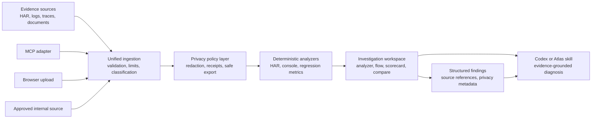

# HAR Analyzer Product Consolidation Plan

Status: Adopted for implementation
Date: 2026-08-14
Primary product: HAR Analyzer

## 1. Decision

HAR Analyzer becomes the single supported investigation product.

- Support Analyzer Workbench enters feature freeze. Its useful deterministic investigation capabilities will be migrated into HAR Analyzer, after which the standalone Workbench deployment can be retired.
- Data Sanitizer enters standalone maintenance mode. Its reusable redaction engine, privacy contracts, fixtures, and verification patterns will be extracted into a shared privacy layer used by HAR Analyzer and its Codex skills.
- Codex remains the conversational diagnosis and orchestration layer. HAR Analyzer remains the deterministic visual evidence viewer and analysis engine.
- New feature work must target HAR Analyzer unless an approved architecture decision records a reason to use another product.

This is a consolidation, not a wholesale copy of either legacy application.

## 2. Why this direction

The current products overlap:

- HAR Analyzer already provides HAR and console-log ingestion, request analysis, request flow, scorecards, sanitization, AI insight surfaces, chunked upload support, OCI deployment assets, and an evidence-analysis Codex skill.
- Support Analyzer Workbench adds useful console-log workflows, MCP ingestion, and deep-link investigation. Its inferred correlation views, generic routing, narrative report generation, separate AI diagnosis surface, and separate deployment are not migration targets.
- Data Sanitizer contains the stronger privacy and analysis-preserving redaction model, but its original standalone workflow is less compelling if the organization formally permits approved enterprise AI processing of support data.

Consolidation reduces three deployment paths, three backlogs, duplicated UI, and conflicting product identities to one supported product and one operating model.

## 3. Constraints and assumptions

### Verified repository facts

- HAR Analyzer already has deterministic HAR and console-log analyzers, sanitization routes, an AI integration boundary, upload handling, and OCI deployment material.
- Workbench contains capabilities that are absent or more mature in HAR Analyzer, including deterministic console issue maps and comparisons, MCP evidence tools, deep links, and several experimental routing and correlation surfaces.
- Data Sanitizer contains reusable redaction contracts, fixtures, verification logic, policy concepts, and platform-specific standalone applications.

### Policy assumption requiring written confirmation

Statements that enterprise AI data is not retained or used externally must not be treated as a replacement for an approved data-handling policy. Until a written policy identifies allowed systems, data classes, retention, and customer-data restrictions:

- sanitization remains available and enabled at trust-boundary operations;
- secrets and authentication material must never be sent to an AI provider;
- raw evidence must not be copied into tickets, chat, exports, or model prompts by default;
- audit-safe receipts should record what policy was applied without retaining sensitive values.

### Non-goals

- Rebuilding Workbench inside HAR Analyzer pixel for pixel.
- Moving operating-system clipboard tools into the browser application.
- Keeping a separate vector database, local-model stack, or AI service only because Workbench previously used one.
- Removing Data Sanitizer before its reusable privacy assets and release evidence are preserved.
- Claiming production approval solely because the current OCI deployment is technically functional.

## 4. Target architecture

### Component responsibilities

| Component | Responsibility | Must not do |
|---|---|---|
| Unified ingestion | Validate files, enforce size/type limits, assign evidence identity, and route to the correct analyzer | Diagnose an issue or silently weaken validation |
| Privacy policy layer | Apply policy-based redaction at import, model, share, and export boundaries; create non-sensitive receipts | Treat a generic enterprise-plan statement as blanket authorization |
| Deterministic analyzers | Produce reproducible facts, metrics, and classifications | Infer causality from proximity, ordering, or message similarity |
| Investigation workspace | Present evidence, exact comparisons, flows, scorecards, and selected-request details | Become a second backend or construct an incident narrative |
| Codex/Atlas skill | Explain deterministic findings, request missing evidence, and form support hypotheses | Invent evidence or bypass the privacy policy layer |
| MCP adapter | Accept authenticated evidence and return stable workspace/evidence references | Depend on client-local filesystem paths unavailable to the service |
| Structured findings export | Return machine-readable findings, source references, analyzer version, and privacy metadata | Generate narrative conclusions or recommended actions |

## 5. Product boundaries

### HAR Analyzer: active core product

Owns:

- evidence ingestion and classification;
- HAR, console-log, and future supported evidence analysis;
- visual investigation, exact comparison, Request Flow, and scorecards;
- privacy controls applied to evidence workflows;
- the supported OCI deployment;
- supported Codex/Atlas and MCP integration surfaces;
- monitoring, release, support, and documentation.

### Support Analyzer Workbench: migration source

Allowed work:

- security or data-loss fixes;
- export or compatibility work required to migrate data;
- tests that establish expected behavior for a feature being migrated;
- retirement documentation.

Disallowed work:

- net-new product features;
- a new independent AI architecture;
- deployment expansion that competes with HAR Analyzer;
- UI redesign unrelated to migration.

### Data Sanitizer: privacy-core source and maintenance product

Retain as reusable assets:

- redaction contracts and structured findings;
- analysis-preserving replacements;
- fixtures, adversarial tests, and regression corpus;
- policy profiles and safe defaults;
- redaction receipts and verification checks;
- format-specific adapters that HAR Analyzer actually consumes.

Keep outside HAR Analyzer:

- clipboard and desktop operating-system integrations;
- unrelated platform installers and application shells;
- duplicate upload or viewer experiences;
- release machinery that only serves the standalone desktop products.

## 6. Migration approach

### Phase 0 - Freeze and preserve

1. Record the exact Workbench and Data Sanitizer source commits used for migration.
2. Export their open issues, deployment notes, test results, and known limitations.
3. Mark both products as maintenance-only in their own documentation.
4. Do not delete deployments, repositories, images, object-store data, or secrets.

Exit gate: the source and operational state can be reconstructed without relying on an old chat or an engineer's memory.

### Phase 1 - Close the deterministic investigation gaps

Migrate and harden the highest-value deterministic features first:

1. console-log issue map;
2. exact console-log comparison;
3. Analyzer and waterfall;
4. Request Flow and Scorecard;
5. HAR comparison and fast search/filtering;
6. structured findings export and supported-format validation.

Explicit exclusions:

- no time-window action chains or cross-source incident timeline;
- no generic routing for unrelated files;
- no duplicate narrative support-report generator.

Exit gate: migrated features have acceptance tests in HAR Analyzer and do not require the Workbench service to operate.

### Phase 2 - Integrate the privacy core

1. Define the shared redaction result and receipt contracts.
2. Port only the adapters needed for supported HAR Analyzer evidence.
3. Add explicit policy profiles for local analysis, approved enterprise AI, support-ticket export, and external sharing.
4. Verify that model and export paths cannot bypass the selected policy.

Exit gate: representative HAR and console fixtures retain diagnostic value while configured sensitive values are removed.

### Phase 3 - Consolidate integrations

1. Implement an MCP adapter around HAR Analyzer's stable evidence APIs.
2. Preserve stable workspace, file, and evidence identifiers for shareable investigations.
3. Make MCP uploads accept server-visible paths or bounded inline content; never assume access to a user's Windows path.
4. Update the Codex skill to use deterministic outputs first, produce narrative diagnosis or support communication when requested, and use the visual workspace only when useful.

Exit gate: a Codex/Atlas client can submit supported evidence, obtain deterministic findings, open the corresponding investigation, and generate a privacy-safe report.

### Phase 4 - Retire duplicate services

1. Put Workbench into read-only mode.
2. Run a defined observation period with no required Workbench-only workflow.
3. Archive, rather than immediately delete, the Workbench deployment and source.
4. Keep Data Sanitizer binaries available only if there is a documented consumer; otherwise archive their release path after the privacy core has moved.

Exit gate: rollback artifacts exist, no active consumer depends on the legacy service, and ownership approves retirement.

## 7. Security and privacy invariants

- Raw evidence is untrusted input.
- Upload type, decompressed size, entry count, and parsing time are bounded.
- Archives are protected against path traversal and decompression bombs.
- HTML, document content, filenames, headers, URLs, and logs are encoded before display.
- Tokens, cookies, authorization headers, passwords, and private keys are never logged.
- AI calls receive the minimum evidence required for the task and only after the configured privacy policy runs.
- Deterministic observations and AI hypotheses are visually distinct.
- Every external share or export is sanitized or explicitly approved under a documented policy.
- Authentication, authorization, retention, deletion, and audit behavior are tested independently.

## 8. Repository and release model

- HAR Analyzer remains the primary repository and deployable product.
- Migrated code is rewritten or ported into HAR Analyzer modules; the application must not take a runtime dependency on the Workbench repository.
- A small privacy package may live in the HAR Analyzer repository initially. It can become a separate versioned library only after at least two real consumers require it.
- Each migrated feature is delivered independently with tests and a rollback path.
- The current live OCI architecture remains the baseline until a separately approved migration replaces it.
- Source-complete, tested, image-built, deployed, security-scanned, and production-approved are tracked as different states.

## 9. Retirement gates

### Workbench may be retired only when

- all approved migration features are accepted in HAR Analyzer;
- MCP clients have moved or a compatibility adapter exists;
- deep links and retained evidence have an export or migration path;
- no active user or automation depends on its endpoints;
- logs and operational records required by policy are retained;
- rollback instructions and the final image digest are recorded.

### Data Sanitizer standalone releases may be retired only when

- the governing data-handling policy is documented;
- the reusable redaction core and fixtures have a maintained owner;
- HAR Analyzer uses and tests the required privacy controls;
- known desktop/clipboard consumers have been identified;
- security and release records are archived;
- an owner approves the end of standalone distribution.

## 10. Success measures

- One supported browser product and one supported deployment path.
- One prioritized backlog for investigation features, privacy, and operations.
- No Workbench-only workflow required by an active user.
- Deterministic findings remain reproducible without AI.
- Privacy policy coverage is measurable at import, model, share, and export boundaries.
- Mean time from evidence upload to a usable first finding decreases.
- Production health, failures, latency, and deployment version are observable without manually opening container logs.

## 11. Immediate implementation slice

The first implementation slice is the deterministic console investigation package:

1. console-log issue map;
2. exact console-log comparison;
3. their existing behavioral tests, adapted to HAR Analyzer contracts;
4. navigation from the existing console-log analysis surface;
5. explicit rejection of inferred action chains and cross-source timelines.

This slice is chosen because it adds immediate diagnostic value, is already evidenced by working Workbench code and tests, and does not require new OCI infrastructure or an AI provider.
